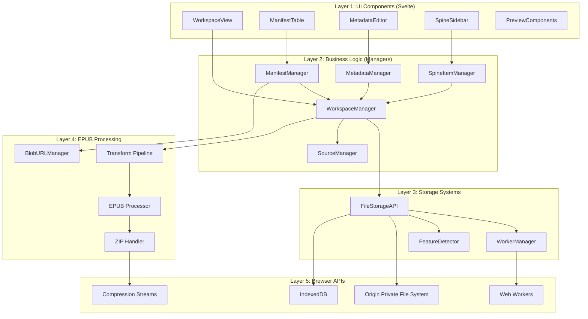
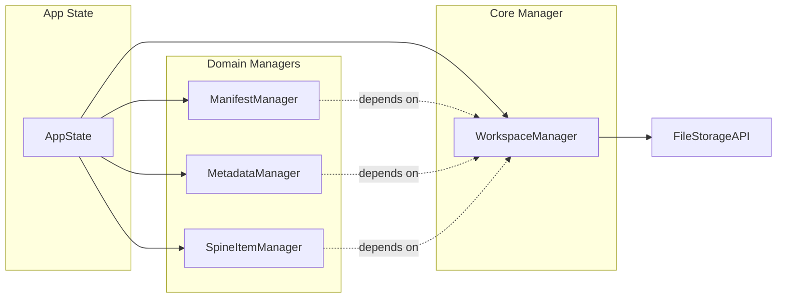
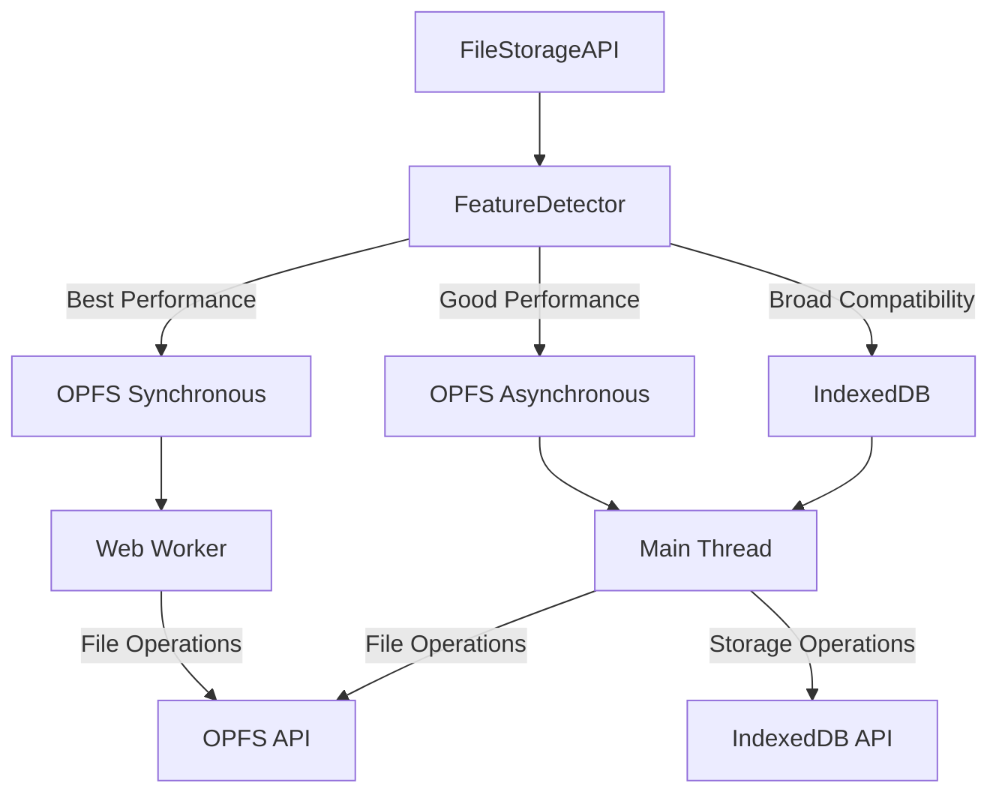
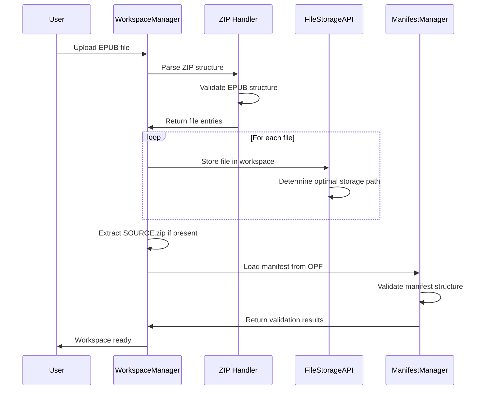
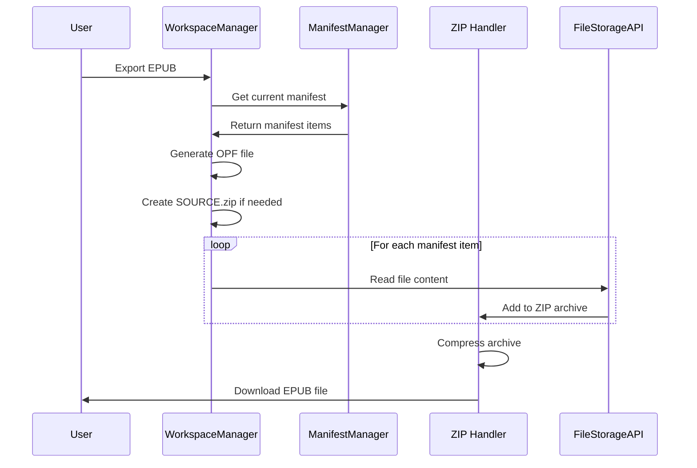
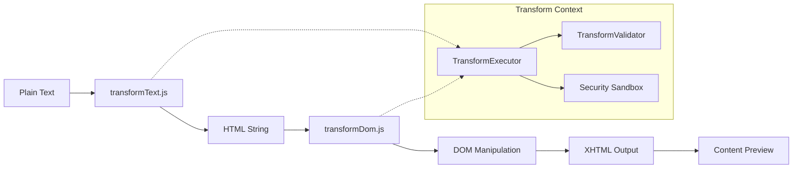
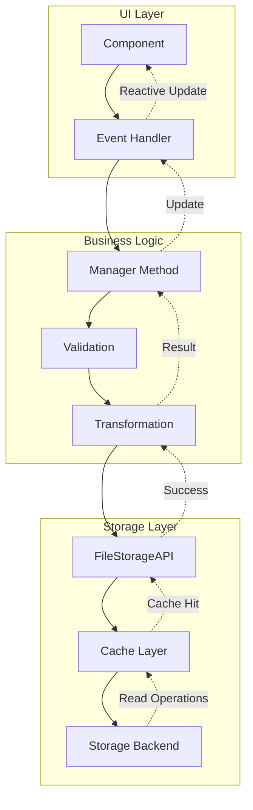
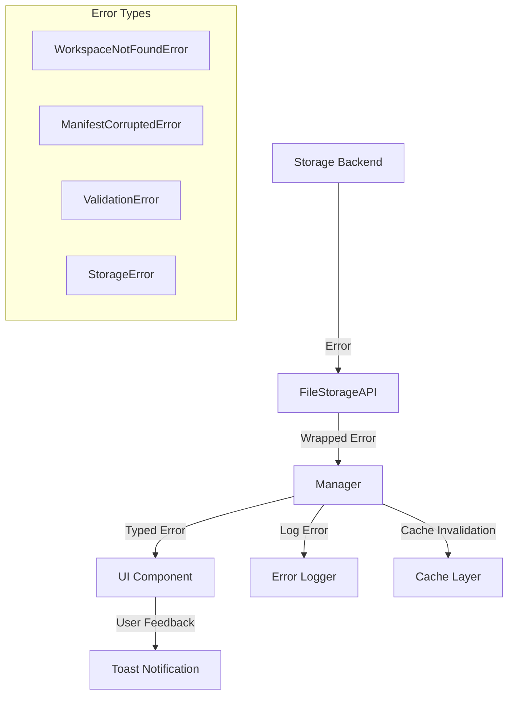
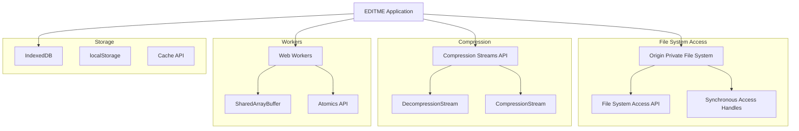

# EDITME.html - System Architecture

This document provides a comprehensive overview of the EDITME.html EPUB editor's architecture, component relationships, and key design patterns.

## Table of Contents

- [Overview](#overview)
- [Architectural Layers](#architectural-layers)
- [Core Components](#core-components)
- [Manager Pattern](#manager-pattern)
- [Storage Architecture](#storage-architecture)
- [EPUB Processing Pipeline](#epub-processing-pipeline)
- [State Management](#state-management)
- [Data Flow](#data-flow)
- [Error Handling](#error-handling)
- [Browser Integration](#browser-integration)
- [Development Guidelines](#development-guidelines)

## Overview

EDITME.html is a browser-based EPUB editor built with Svelte 5 and TypeScript. It transforms plain text into formatted EPUB files using a sophisticated transformation pipeline and modern browser APIs.

### Distribution Model

- **Web Application**: Hosted version accessible via browser
- **Standalone HTML**: Single ~2-3MB file for offline use
- **Active EPUB**: Self-editing EPUB files with embedded editor

### Key Design Principles

1. **Workspace-Centric**: All operations revolve around workspace management
2. **Manager Pattern**: Domain-driven business logic separation
3. **Progressive Enhancement**: Optimal performance with broad compatibility
4. **Browser-Native**: Leverages modern APIs with fallbacks
5. **Reactive Architecture**: Svelte 5 runes for efficient state management

## Architectural Layers



## Core Components

### Layer 1: UI Components

```
src/lib/components/
├── manifest/          # EPUB manifest management UI
│   ├── ManifestTable.svelte
│   ├── ManifestItemEditor.svelte
│   └── ManifestActions.svelte
├── metadata/          # EPUB metadata editing
│   ├── MetadataEditor.svelte
│   └── MetadataFields.svelte
├── outline/           # Table of contents/navigation
│   └── OutlineEditor.svelte
├── preview/           # Content preview components
│   ├── ContentPreview.svelte
│   └── DevicePreview.svelte
├── workspace/         # Workspace selection/management
│   ├── WorkspaceView.svelte
│   ├── WorkspaceList.svelte
│   └── WorkspaceItem.svelte
└── SpineSidebar.svelte # Reading order management
```

### Layer 2: Business Logic Managers

```
src/lib/
├── workspace/         # Core workspace management
│   ├── workspace-manager.ts
│   ├── workspace-cache.ts
│   └── types.ts
├── manifest/          # EPUB manifest operations
│   ├── manifest-manager.ts
│   ├── validation.ts
│   └── utils.ts
├── metadata/          # EPUB metadata handling
│   └── metadata-manager.ts
├── spine/            # Reading order management
│   └── spine-item-manager.ts
├── source/           # SOURCE/ directory management
│   └── source-manager.ts
└── transform/        # Text processing pipeline
    ├── transform-executor.ts
    └── transform-validator.ts
```

## Manager Pattern

The system uses a consistent manager pattern for domain-driven business logic:



### Manager Responsibilities

| Manager | Primary Responsibilities |
|---------|-------------------------|
| **WorkspaceManager** | File system operations, OPF management, workspace lifecycle |
| **ManifestManager** | EPUB manifest CRUD, content operations, validation |
| **MetadataManager** | EPUB metadata operations, Dublin Core compliance |
| **SpineItemManager** | Reading order management, spine validation |
| **SourceManager** | SOURCE/ directory handling, advanced mode operations |

### Manager Interfaces

All managers implement consistent patterns:

```typescript
// Example: ManifestManager interface structure
export interface IManifestManager {
  // Core data operations
  loadManifest(workspaceId: string): Promise<ManifestItem[]>;
  getManifestItem(workspaceId: string, itemId: string): Promise<ManifestItem>;
  updateManifestItem(workspaceId: string, itemId: string, updates: Partial<ManifestItem>): Promise<void>;
  
  // Content operations
  getItemContent(workspaceId: string, itemId: string): Promise<ArrayBuffer | string>;
  setItemContent(workspaceId: string, itemId: string, content: ArrayBuffer | string): Promise<void>;
  
  // Cache management
  clearCache(workspaceId?: string): void;
  preloadManifest(workspaceId: string): Promise<void>;
}
```

## Storage Architecture

### Multi-Backend Strategy



### Storage Decision Tree

```typescript
export type BackendType = 'opfs-sync' | 'opfs-async' | 'indexeddb';

// Feature detection determines optimal backend
const backend = await FileStorageAPI.detectStorageBackend();

switch (backend) {
  case 'opfs-sync':
    // Web Worker with synchronous access handles
    // Best performance for large file operations
    break;
  case 'opfs-async':
    // Main thread with asynchronous file operations
    // Good performance, broader compatibility
    break;
  case 'indexeddb':
    // Fallback for maximum browser support
    // Acceptable performance for most operations
    break;
}
```

### Workspace Organization

```
Storage Backend/
├── workspaces/
│   ├── {workspace-id}/
│   │   ├── META-INF/
│   │   ├── OEBPS/
│   │   │   ├── Text/
│   │   │   ├── Styles/  
│   │   │   ├── Images/
│   │   │   └── Scripts/
│   │   └── SOURCE/          # Editor-specific files
│   │       ├── settings.json
│   │       ├── transforms/
│   │       └── extensions/
│   └── cache/
│       ├── workspace-list.json
│       └── {workspace-id}-metadata.json
```

## EPUB Processing Pipeline

### EPUB Import Flow



### EPUB Export Flow



### Text Transformation Pipeline



## State Management

### Global App State

```typescript
export class AppState {
  // Core workspace management
  currentWorkspaceManager = $state<IWorkspaceManager | null>(null);
  currentWorkspaceId = $state<string | null>(null);
  
  // Domain-specific managers (created per workspace)
  currentManifestManager = $state<ManifestManagerImpl | null>(null);
  currentMetadataManager = $state<MetadataManagerImpl | null>(null);
  currentSpineItemManager = $state<SpineItemManagerImpl | null>(null);
  
  // UI state
  isLoading = $state<boolean>(false);
  error = $state<string | null>(null);
}
```

### Reactive Stores

```typescript
// Navigation state with persistence
export const navigationStore = createNavigationStore();

// Layout management
export const layoutStore = createLayoutStore();

// Workspace cache (reactive list updates)
export const workspaceCache = new WorkspaceCache();
```

## Data Flow

### Component → Manager → Storage Flow



### Error Propagation



## Error Handling

### Error Classification

| Error Type | Source | Recovery Strategy |
|------------|--------|------------------|
| `WorkspaceNotFoundError` | WorkspaceManager | Redirect to workspace selection |
| `ManifestCorruptedError` | ManifestManager | Offer repair or recreation |
| `ValidationError` | Validation Layer | Show specific field errors |
| `StorageError` | FileStorageAPI | Retry with different backend |
| `TransformError` | Transform Pipeline | Fallback to plain text |

### Error Recovery Patterns

```typescript
// Example: Manager-level error handling
try {
  const result = await this.workspaceManager.operation();
  return result;
} catch (error: any) {
  // Transform storage errors into domain errors
  if (error.message.includes('not found')) {
    throw new WorkspaceNotFoundError(workspaceId);
  }
  
  // Clear relevant caches on error
  this.clearCache(workspaceId);
  
  // Re-throw with context
  throw new Error(`Operation failed: ${error.message}`);
}
```

## Browser Integration

### Modern Web APIs



### Feature Detection

```typescript
export class FeatureDetector {
  static async detectStorageBackend(): Promise<BackendType> {
    // Test for OPFS with synchronous access handles
    if (await this.supportsOPFSSync()) {
      return 'opfs-sync';
    }
    
    // Test for basic OPFS support
    if (await this.supportsOPFS()) {
      return 'opfs-async';
    }
    
    // Fallback to IndexedDB
    return 'indexeddb';
  }
  
  private static async supportsOPFSSync(): Promise<boolean> {
    try {
      const root = await navigator.storage.getDirectory();
      const fileHandle = await root.getFileHandle('test', { create: true });
      const accessHandle = await fileHandle.createSyncAccessHandle();
      await accessHandle.close();
      await root.removeEntry('test');
      return true;
    } catch {
      return false;
    }
  }
}
```

## Development Guidelines

### Adding New Managers

1. **Create Manager Interface**: Define the public API contract
2. **Implement Manager Class**: Follow existing patterns and error handling
3. **Add to AppState**: Register in global state management
4. **Create Tests**: Comprehensive unit and integration tests
5. **Update Documentation**: Add to this architecture guide

### Component Development

1. **Use Reactive State**: Leverage Svelte 5 runes for state management
2. **Manager Injection**: Receive managers through AppState
3. **Error Boundaries**: Handle and display errors appropriately
4. **Accessibility**: Follow WCAG guidelines and keyboard navigation
5. **Internationalization**: Use the reactive i18n system

### Storage Best Practices

1. **Workspace Isolation**: Never cross workspace boundaries
2. **Cache Management**: Implement proper cache invalidation
3. **Error Recovery**: Handle storage failures gracefully
4. **Performance**: Use appropriate storage backend for operation type
5. **Security**: Validate all file paths and content

### Testing Strategy

1. **Unit Tests**: Test manager methods with mocked dependencies
2. **Integration Tests**: Test component-manager interactions
3. **Browser Tests**: Test storage backends and API integration
4. **E2E Tests**: Test complete user workflows

---

This architecture provides a solid foundation for understanding how EDITME.html components interact and how to extend the system. For specific implementation details, refer to the individual API documentation in each module.