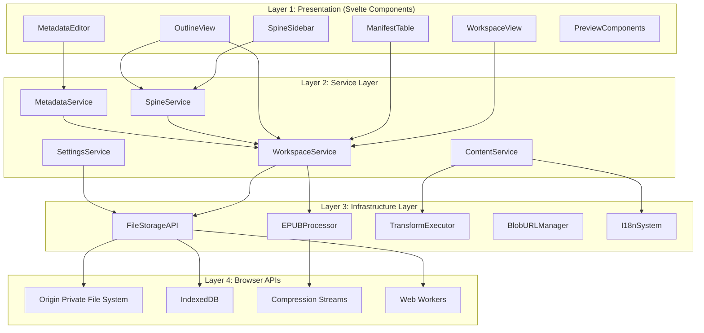
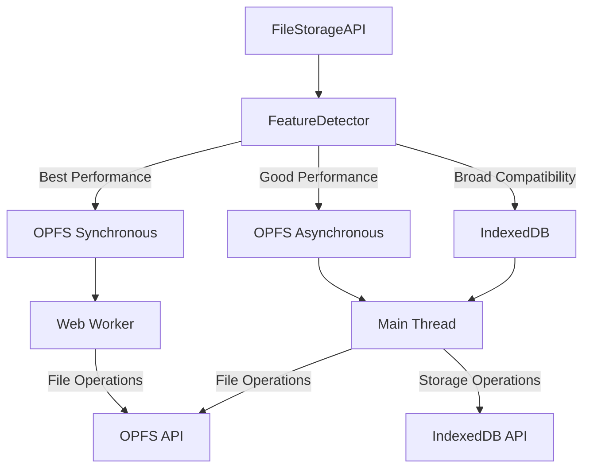
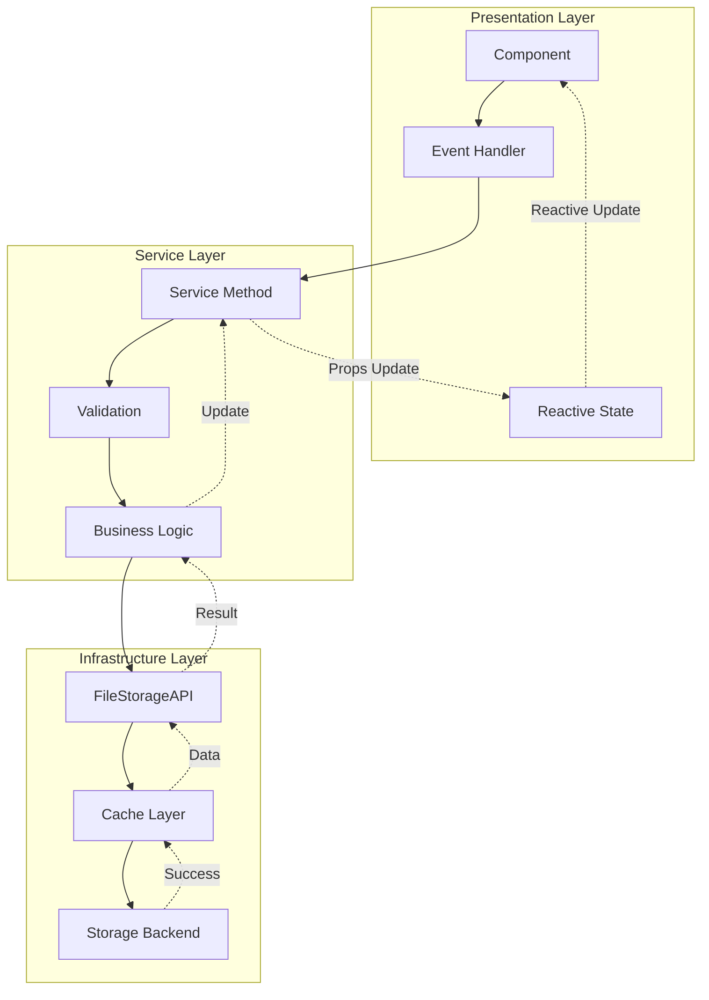
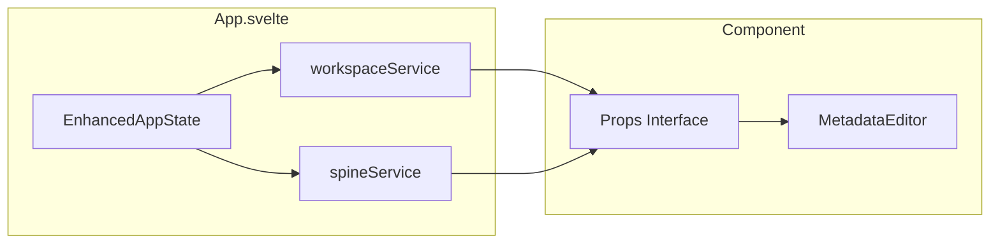
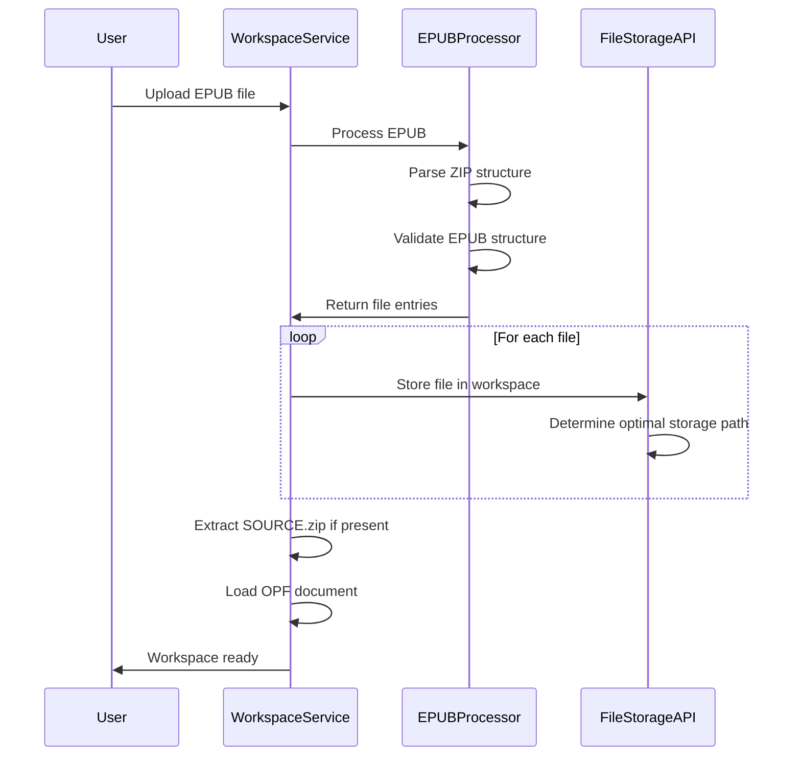
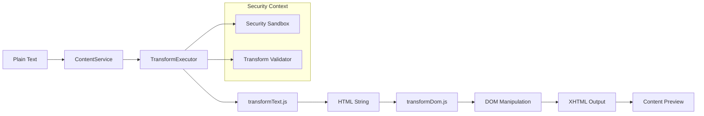
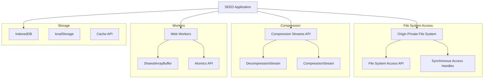

# SEED.html - System Architecture

This document provides a comprehensive overview of the SEED.html EPUB editor's architecture, component relationships, and key design patterns.

## Table of Contents

- [Overview](#overview)
- [Architectural Layers](#architectural-layers)
- [Service Architecture](#service-architecture)
- [Storage Architecture](#storage-architecture)
- [State Management](#state-management)
- [Data Flow](#data-flow)
- [EPUB Processing Pipeline](#epub-processing-pipeline)
- [Error Handling](#error-handling)
- [Browser Integration](#browser-integration)
- [Development Guidelines](#development-guidelines)

## Overview

SEED.html is a browser-based EPUB editor built with Svelte 5 and TypeScript. It transforms plain text into formatted EPUB files using a sophisticated transformation pipeline and modern browser APIs.

> This document is the whole-system overview. For the deep-dive on the spine-item
> editor + persistent-iframe transform/preview subsystem, see
> [PERSISTENT_IFRAME_ARCHITECTURE.md](./PERSISTENT_IFRAME_ARCHITECTURE.md).

### Distribution Model

- **Web Application**: Hosted version accessible via browser
- **Standalone HTML**: Single ~1MB file for offline use
- **Active EPUB**: Self-editing EPUB files with embedded editor

### Key Design Principles

1. **Project-Centric**: All operations revolve around project management
2. **Service Architecture**: Clean 3-layer architecture with dependency injection
3. **Progressive Enhancement**: Optimal performance with broad compatibility
4. **Browser-Native**: Leverages modern APIs with fallbacks
5. **Reactive Architecture**: Svelte 5 runes for efficient state management

## Architectural Layers



## Service Architecture

### Clean 3-Layer Design

The application follows a clean service architecture with strict layer separation:

```
Presentation Layer (UI Components)
    ↓ (Props injection)
Service Layer (Business Logic)
    ↓ (Dependency injection)
Infrastructure Layer (External APIs)
```

### Service Layer Components

```
src/lib/services/
├── workspace/
│   ├── workspace.service.ts      # Core workspace operations
│   └── workspace.service.test.ts
├── content/
│   ├── content.service.ts        # Text transformation pipeline
│   └── content.service.test.ts
├── settings/
│   ├── settings.service.ts       # Multi-tier settings management
│   └── settings.service.test.ts
├── spine/
│   ├── spine.service.ts          # Reading order management
│   └── spine.service.test.ts
├── metadata/
│   ├── metadata.service.ts       # EPUB metadata operations
│   └── metadata.service.test.ts
└── epub/
    ├── epub-processor.service.ts # EPUB processing wrapper
    └── epub-processor.service.test.ts
```

### Service Responsibilities

| Service              | Primary Responsibilities                                       |
| -------------------- | -------------------------------------------------------------- |
| **WorkspaceService** | File system operations, OPF management, workspace lifecycle    |
| **ContentService**   | Text transformation, XHTML generation, content processing      |
| **SettingsService**  | Multi-tier settings (global, workspace, EPUB), draft mode      |
| **SpineService**     | Reading order management, spine validation, chapter operations |
| **MetadataService**  | EPUB metadata operations, Dublin Core compliance               |
| **EPUBProcessor**    | EPUB import/export, ZIP handling, validation                   |

### Service Interfaces

All services implement consistent patterns with dependency injection:

```typescript
// Example: WorkspaceService interface
export class WorkspaceService {
  constructor(private fileStorage: FileStorageAPI) {}

  // Core workspace operations
  async createWorkspace(title: string, language: string): Promise<string>;
  async loadWorkspace(id: string): Promise<WorkspaceState>;
  async deleteWorkspace(id: string): Promise<void>;

  // File operations
  async writeFile(workspaceId: string, path: string, content: string | ArrayBuffer): Promise<void>;
  async readFile(workspaceId: string, path: string): Promise<ArrayBuffer>;
  async fileExists(workspaceId: string, path: string): Promise<boolean>;
}
```

## Storage Architecture

### Multi-Backend Strategy



### Storage Decision Tree

```typescript
export type BackendType = 'opfs-sync' | 'opfs-async' | 'indexeddb';

// Feature detection determines optimal backend
const backend = await FileStorageAPI.detectStorageBackend();

switch (backend) {
  case 'opfs-sync':
    // Web Worker with synchronous access handles
    // Best performance for large file operations (16x faster)
    break;
  case 'opfs-async':
    // Main thread with asynchronous file operations
    // Good performance, broader compatibility
    break;
  case 'indexeddb':
    // Fallback for maximum browser support
    // Acceptable performance for most operations
    break;
}
```

### Workspace Organization

```
Storage Backend/
├── workspaces/
│   ├── {workspace-id}/
│   │   ├── META-INF/
│   │   ├── OEBPS/
│   │   │   ├── Text/
│   │   │   ├── Styles/
│   │   │   ├── Images/
│   │   │   └── Scripts/
│   │   └── SOURCE/          # Editor-specific files
│   │       ├── settings.json
│   │       ├── text/
│   │       ├── scripts/
│   │       └── extensions/
│   └── cache/
│       ├── workspace-list.json
│       └── {workspace-id}-metadata.json
```

## State Management

### Enhanced AppState with Svelte 5 Runes

```typescript
export class EnhancedAppState {
  // Single source of truth - workspace state
  workspace = $state<WorkspaceState | null>(null);
  workspaceLoading = $state<string | null>(null);

  // Derived reactive state
  currentWorkspaceId = $derived(this.workspace?.id || null);
  isLoading = $derived(this.workspaceLoading !== null);
  initialized = $derived(this.fileStorageAPI !== null);

  // Service instances (private)
  private workspaceService: WorkspaceService;
  private contentService: ContentService;
  private settingsService: SettingsService;

  constructor(
    fileStorageAPI: FileStorageAPI,
    transformExecutor: TransformExecutor,
    i18nService: I18nSystem,
    extensionManager: ExtensionManager,
    themeStore: ThemeStore,
    i18nStore: I18nStore
  ) {
    // Initialize services with dependency injection
    this.workspaceService = new WorkspaceService(fileStorageAPI);
    this.contentService = new ContentService(transformExecutor, i18nService);
    this.settingsService = new SettingsService(fileStorageAPI, extensionManager);
  }

  // Reactive coordination with $effect
  $effect(() => {
    if (this.workspaceLoading && this.workspace?.id !== this.workspaceLoading) {
      this.loadWorkspace();
    }
  });
}
```

### Component State Management

Components receive services via props and use reactive state:

```svelte
<script lang="ts">
  import type {
    WorkspaceService,
    WorkspaceState,
  } from '../services/workspace/workspace.service.js';

  // Service injection via props (runes)
  let {
    workspace,
    workspaceService,
  }: {
    workspace: WorkspaceState;
    workspaceService: WorkspaceService;
  } = $props();

  // Local reactive state
  let loading = $state(false);
  let error = $state<string | null>(null);

  // Derived reactive computations
  let manifestItems = $derived(workspace?.opf?.manifest || []);
  let isValid = $derived(manifestItems.length > 0);
</script>
```

## Data Flow

### Service-Based Data Flow



### Prop Injection Pattern



## EPUB Processing Pipeline

### EPUB Import Flow



### Text Transformation Pipeline



## Error Handling

### Service-Level Error Handling

```typescript
// Service layer error patterns
export class WorkspaceServiceError extends Error {
  constructor(message: string, public code: string, public workspaceId?: string) {
    super(message);
    this.name = 'WorkspaceServiceError';
  }
}

// Usage in service methods
async loadWorkspace(id: string): Promise<WorkspaceState> {
  try {
    const exists = await this.fileStorage.fileExists(id, 'META-INF/container.xml');
    if (!exists) {
      throw new WorkspaceServiceError('Workspace not found', 'WORKSPACE_NOT_FOUND', id);
    }
    // ... load workspace
  } catch (error) {
    if (error instanceof WorkspaceServiceError) {
      throw error; // Re-throw service errors
    }
    throw new WorkspaceServiceError('Failed to load workspace', 'LOAD_ERROR', id);
  }
}
```

### Error Classification

| Error Type              | Source             | Recovery Strategy               |
| ----------------------- | ------------------ | ------------------------------- |
| `WorkspaceServiceError` | WorkspaceService   | Redirect to workspace selection |
| `ContentServiceError`   | ContentService     | Fallback to plain text          |
| `SettingsServiceError`  | SettingsService    | Use default settings            |
| `StorageError`          | FileStorageAPI     | Retry with different backend    |
| `ValidationError`       | Service validation | Show specific field errors      |

## Browser Integration

### Modern Web APIs



### Feature Detection

```typescript
export class FeatureDetector {
  static async detectStorageBackend(): Promise<BackendType> {
    // Test for OPFS with synchronous access handles
    if (await this.supportsOPFSSync()) {
      return 'opfs-sync';
    }

    // Test for basic OPFS support
    if (await this.supportsOPFS()) {
      return 'opfs-async';
    }

    // Fallback to IndexedDB
    return 'indexeddb';
  }

  private static async supportsOPFSSync(): Promise<boolean> {
    try {
      const root = await navigator.storage.getDirectory();
      const fileHandle = await root.getFileHandle('test', { create: true });
      const accessHandle = await fileHandle.createSyncAccessHandle();
      await accessHandle.close();
      await root.removeEntry('test');
      return true;
    } catch {
      return false;
    }
  }
}
```

## Development Guidelines

### Adding New Services

1. **Create Service Class**: Follow existing patterns with dependency injection
2. **Define Service Interface**: Clear method signatures and error handling
3. **Add to AppState**: Register in EnhancedAppState constructor
4. **Inject via Props**: Pass service to components that need it
5. **Write Tests**: Comprehensive unit and integration tests

### Component Development

1. **Use Svelte 5 Runes**: Leverage $state, $derived, $effect for reactivity
2. **Service Props**: Receive services through props, not context
3. **Error Boundaries**: Handle and display service errors appropriately
4. **Accessibility**: Follow WCAG guidelines and keyboard navigation
5. **Internationalization**: Use the reactive i18n system

### Service Best Practices

1. **Single Responsibility**: Each service handles one domain
2. **Dependency Injection**: Services depend only on infrastructure layer
3. **No Service-to-Service Calls**: Keep services independent
4. **Error Handling**: Use typed errors with recovery strategies
5. **Testing**: Mock infrastructure dependencies only

### Testing Strategy

1. **Service Tests**: Test business logic with mocked infrastructure
2. **Component Tests**: Test UI with service props
3. **Integration Tests**: Test service-component interactions
4. **E2E Tests**: Test complete user workflows

### Migration Notes

This architecture represents a complete migration from the previous manager-based system to a clean service architecture:

- **Removed**: 16,416 lines of manager code
- **Added**: 214 lines of service code
- **Benefits**: Cleaner separation of concerns, better testability, improved maintainability
- **Performance**: Preserved storage backend performance (16x OPFS advantage)

---

This architecture provides a solid foundation for understanding how SEED.html components interact and how to extend the system. For specific implementation details, refer to the individual service API documentation in each module.
