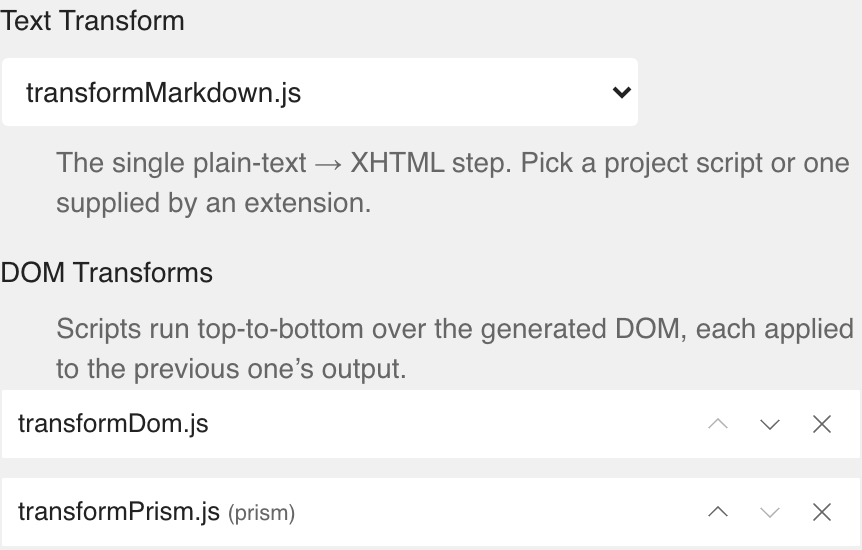

# The text pipeline

SEED.html builds every chapter from your plain-text source in two passes. A **text transform** turns the source into an HTML string; a **DOM transform** then reshapes that HTML into the final XHTML. You can replace or extend either pass, and almost everything else in this manual is built on the same two function contracts.

{.figure}
The same XHTML that ends the pipeline is what the preview shows and what the packaged EPUB carries — one rendered chapter, two destinations.
{.caption}

## Two functions

A text transform is a script that defines a function named `transformText`. A DOM transform defines `transformDOM`. The file can be called anything — `transformMarkdown.js`, `storeImageReferences.js` — but the entry function's name is fixed, and that's how SEED.html finds it.

### transformText

```js
function transformText(text, idref, ctx) {
  // return an HTML string
}
```

It receives the chapter's source `text`, the chapter's spine id as `idref`, and an optional `ctx` — a context object for reaching the rest of the project, covered in a later chapter. It returns an HTML string — synchronously, or a `Promise<string>` if it needs to await something. Whatever it returns is parsed into a DOM document for the next pass.

A text transform can be as small as a regular expression. This one turns a leading `# ` into an `<h1>`:

```js
function transformText(text, idref) {
  return text.replace(/^# (.+)$/gm, '<h1>$1</h1>');
}
```

That's the whole contract: text in, HTML out.

Once a transform reads or writes project files through `ctx` (a later chapter), where every call is asynchronous, this becomes an `async` function.

Swap the text transform and you've changed the syntax authors write in — that's all an authoring format is here. Real formats (Markdown, Djot, Textile) do the same job with a proper parser rather than a regex, and arrive as extensions (the next chapter).

### transformDOM

```js
function transformDOM(htmlDocument, idref, ctx) {
  // reshape htmlDocument
}
```

It receives a parsed `Document` — the output of the text pass — along with the same `idref` and optional `ctx`. Work on it with the DOM methods you'd expect: `querySelectorAll`, `getAttribute`, `setAttribute`, `createElement`. Mutate the document in place.

A DOM transform is just as small. This one gives the `<h1>` the text pass produced a stable `id`, so it can be linked to — using nothing but the DOM:

```js
function transformDOM(htmlDocument, idref) {
  htmlDocument.querySelectorAll('h1').forEach(h1 => {
    if (h1.id) return;
    h1.id = (h1.textContent || '').trim().toLowerCase().replace(/\s+/g, '-');
  });
}
```

And, like the text transform, it can be `async` when it needs to `await` something.

## How a chapter flows through

{.screenshot .half}
Where a project assembles its pipeline: _Project Settings → EPUB Settings_.
{.caption}

The text transform runs first. Its HTML is parsed to a `Document`, which then passes through each DOM transform in turn — every DOM transform receives the document the previous one produced, so order matters. The result is serialised to XHTML for the preview and for the packaged book.

The active transforms are chosen per project in _Project Settings → EPUB Settings_: one **Text Transform**, then an ordered list of **DOM Transforms** you can reorder or remove. The scripts on offer are the project's own together with those supplied by enabled extensions (the next chapter). You can edit any of them from the chapter editor's file dropdown.

## The sandbox

Build-time scripts don't run in the page. SEED.html executes them in an isolated iframe with a deliberately small set of globals: `console`, `JSON`, `Math`, `Date`, `RegExp`, the usual value constructors, `DOMParser`, and `document`. Absent are `eval` and `Function`, the timers, and anything that reaches the network or the surrounding app — `fetch`, `XMLHttpRequest`, `window`, `parent`, `top`. A transform is meant to be a pure function from input to markup, and the sandbox keeps it that way.

The one thing added to that environment is libraries. An extension's library files are loaded into the sandbox as globals, so its transforms can call them — a Markdown extension's `transformText` reaches `window.markdownit`, a Prism extension's `transformDOM` reaches `Prism`. That's the bridge from these toy examples to real ones, and it's the subject of the next chapter.

The full signatures — including the optional `ctx` argument that opens the rest of the book — are collected in _Reference_.
