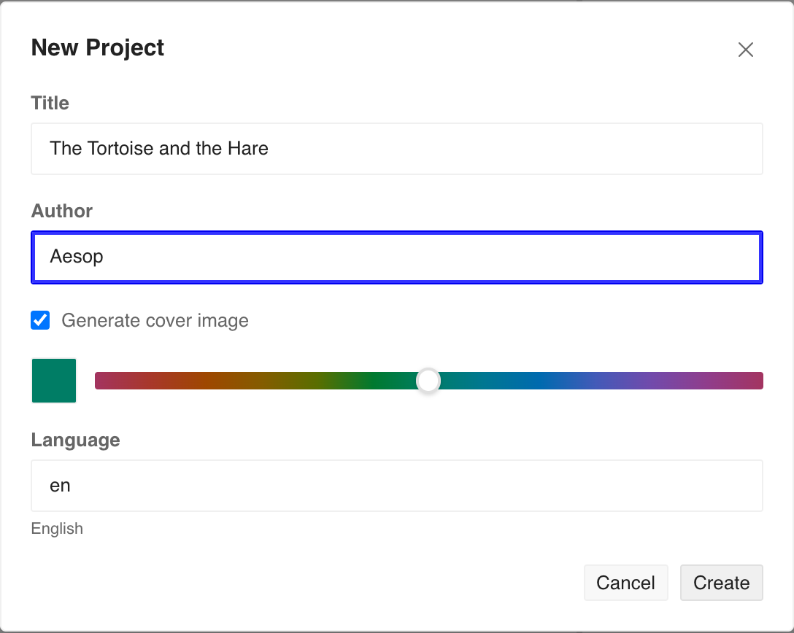

# Make a book

## Start a project

### Create a new project

Open the _Projects_{.ui .icon-house} panel and click _Create New_{.ui} to open the New Project window.

{.figure .screenshot}

Give your book a **Title** and an **Author** — you can change both later.

Leave **Generate cover image** ticked and SEED.html makes a simple coloured cover; drag the slider to choose its colour. You can swap in your own later.

Set the **Language** to the book's main language.

Under **Text format**, choose how you'll write — the way you mark bold, headings, and the like. Keep the default if you're unsure.

Click _Create_{.ui}. SEED.html sets up the book and opens it with one starter chapter.

### Import from a catalog

A catalog is an online list of books you can bring into SEED.html. Open the _Projects_{.ui .icon-house} panel, click _Import from Catalog_{.ui}, and you'll see sample books, each with its cover. Each opens as a ready-made project for the kind of material it shows — a good starting point for a book of your own.

{.figure .screenshot}

Click a book to bring it in; it opens as a project you can edit, like one you started yourself.

The samples show what SEED.html can make — a magazine, sheet music, a novel, a technical manual. Open one to see how it's built, then make it your own: duplicate it (next) or just start changing it.

### Duplicate a project

Duplicating copies the project you have open — a good way to reuse a book as a starting point, whether it's a sample you imported or one of your own, without touching the original.

Open the _Projects_{.ui .icon-house} panel and click _Duplicate_{.ui}. A box appears with the copy's **Title**, prefilled as the original name plus "(copy)"; change it if you like, then click _Duplicate_{.ui} to confirm.

The copy is its own project, separate from the original — changes to one leave the other untouched.

### Import from a file

You can also open a book saved on your device. In the _Projects_{.ui .icon-house} panel, click _Import from File_{.ui} and choose the `.epub`. If it was made in SEED.html, it opens as a project, ready to edit.

An EPUB made in another program opens too, but only to read — it wasn't made in SEED.html, so it can't be edited.

### Find and manage projects

All your books live in the _Projects_{.ui .icon-house} panel, each with its cover, title, and when you last opened it; the one you have open is marked **Current**.

Click a book to switch to it, type in **Search projects** to filter a long list, or _Delete_{.ui} one you no longer need.

## Write and edit chapters

### The chapter editor

Click a chapter in the sidebar to open it. The editor fills the main area in two halves: you write on the left, and a live preview of the finished page shows on the right.

The left pane has a file dropdown at the top. It starts on _Text Content_{.ui} — your chapter's plain text — and also lists the book's stylesheet. Beside it, the **Chapter title** field names the chapter.

Write your chapter in the text area, in whichever format you chose for the book — marking headings, bold, and links as you go. You don't write XHTML yourself; SEED.html transforms your text into it. Your work is kept as you write, with no Save button.

To style the chapter, pick the CSS file from the dropdown; the pane switches to its styles, which change how the book looks rather than what it says. To see text and styles at once, click _Add second editor pane_{.ui} — a second pane opens below the first, and you pick a different file in each.

On the right, the preview shows the page as a reader would see it. Click _Source_{.ui} to switch from the formatted page to the raw XHTML SEED.html produced — read-only, so you can see exactly what goes into the book.

### Reading order (the spine)

The order your chapters appear in the sidebar is the order a reader moves through the book — top to bottom, first page to last. Change the order in the list and you change the book's reading order.

EPUB calls this order the **spine**. It's just your chapter list in order, but it's a useful word to know, since other ebook tools use it too.

### Add, import, reorder, rename and delete chapters

You manage chapters from the _Chapters_{.ui} list in the sidebar. Its header has two buttons: _Append Item_{.ui .icon-plus} adds a new, empty chapter at the end of the list, and _Import text files_{.ui .icon-file-arrow-up} brings in text files from your device — each file you choose becomes a chapter, ready to edit.

To reorder a chapter, drag it up or down the list, or use the up and down arrows that appear when you point at it. Because the list order is the book's reading order, moving a chapter here changes where a reader meets it.

To rename a chapter, open it and edit the **Chapter title** field at the top of the editor; some reading apps show this title. The pencil button opens a small _Edit chapter_{.ui} box for two less-common settings: the chapter's **ID** — its internal name in the EPUB, worth changing to something clearer than `chapter05` — and whether it's part of the reading order.

To remove a chapter, click its delete button — it's taken out of the book entirely.

## Preview your book

### Live preview

The right half of the editor previews the finished page. As you write, SEED.html transforms your text to XHTML and shows it as a reader would see it — formatting, images, and styles in place. The preview keeps up as you type; there's nothing to refresh.

{.figure .screenshot}

### Preview on different devices

A reader might open your book on a phone, a tablet, an e-reader, or a desktop app. The dropdown in the preview header reshapes the preview to match, with presets grouped by where someone reads.

{.figure .screenshot}

Pick a preset and the preview takes on that screen's proportions. The same page reflows to fit each one — fewer words to a line on a phone, more on a tablet. _Fill_{.ui} is the default and fills the preview area.

{.figure .screenshot}

Click _Reader_{.ui} to preview the controls a reading app gives readers: _Light_{.ui}, _Sepia_{.ui}, and _Dark_{.ui} themes, and larger or smaller text.

### Print preview

To see how your book falls onto a printed page, choose the _PDF_{.ui} preset in the same dropdown. The preview switches to a paged layout so you can check where the pages break; its page size and margins are set in _Settings_{.ui .icon-gear}.
