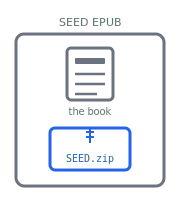

# Before you begin

This manual is for extending a SEED.html book with code. It assumes you're comfortable with JavaScript and EPUB. The SEED.html User Manual covers writing, describing, and producing a book; this one describes how the app supports complex content workflows and advanced Reading System features via the use of JavaScript.

Most of the scripting hooks here run in the authoring phase rather than in the reading system; code that ships in the book itself — the `scripted` manifest property — is covered in the Reading System JavaScript chapter.

An EPUB is an archive of web-page resources, so the natural place to write and preview one is a web browser. SEED.html exploits this to provide a local-first, offline-capable progressive web app that keeps your project files private on your own device.

## Advanced Mode

All of it lives behind **Advanced Mode**. In Basic Mode SEED.html stays focused on writing; Advanced Mode surfaces the scripts, settings, and source files this manual describes. Turn it on in _Settings_{.ui .icon-gear} under **App Settings → General** (the user manual's _Go further_ chapter covers the same switch); everything here assumes it's on.

## The shape of a project

A SEED book carries its own source. Packaged inside the EPUB, beside the readable book, is a `SEED.zip` archive; because it travels in the packaged book, a SEED EPUB carries the machinery that made it: open it again and the project is intact.

{.figure}

Loading the book as a project in SEED.html unpacks that archive into a `SOURCE/` tree — the project itself:

- **settings** — the project's configuration
- **chapter sources** — your plain-text chapters
- **scripts** — the text transforms, DOM transforms, and generators
- **extensions** — the formats and libraries you've added
- **`data/`** — a scratch area that scripts may write to

## Where the code runs

Most scripts here run at **build time** — inside SEED.html, while you edit — in a sandboxed iframe with no network access and no reach into the app page around it. Text transforms, DOM transforms, and generators all run there.

**Reading System JavaScript** is the exception: it ships as a manifest item inside the EPUB and runs in the reading app when someone opens the book, under whatever rules that app places on scripting. The two behave very differently, and the chapters keep them apart.

## What's in this manual

The chapters are organised by where each extension point sits in a book's workflow:

- **The text pipeline** — the two functions that turn source into XHTML, and the contract the rest builds on
- **Extensions** — packaging those functions, their libraries, and a sample syntax so a project can pick them up
- **Generators** — building content from the whole book rather than one chapter
- **The publish-to-remote plugin** — an app-level plugin adding remote storage, OPDS catalogs, and EPUBCheck validation
- **Reading System JavaScript** — code that ships in the book and runs in the reading app
- **Reference** — the entry-point signatures, the `ctx` fields and methods, the generator option schema, and recipes
