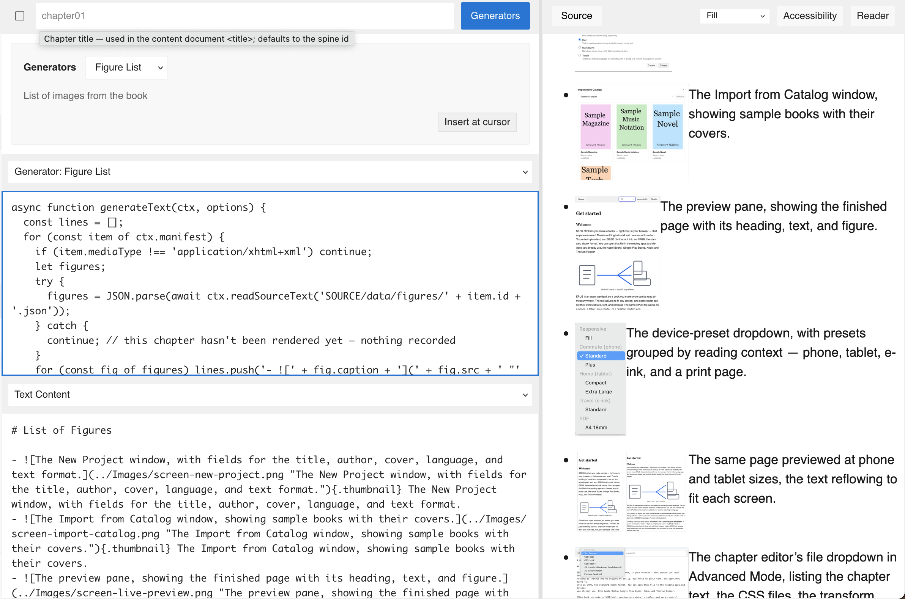

# Generators

Some aspects of a book can be derived from the rest of it — a list of figures, an index, a glossary. None of it is typed by hand; it's generated. SEED.html offers two routes to this kind of content, and both rest on one capability: a script that can read across the whole book, not just the chapter it's running on. That capability is `ctx`.

## Reaching the rest of the book

A transform's first two arguments are about one chapter — its text or DOM, and its `idref`. The optional third, `ctx`, opens the rest of the project: read-only for most of it, with a small writable scratch area. Declare it in the transform function signature and it arrives populated —

```js
function transformText(text, idref, ctx) {
  // ...
}

function transformDOM(htmlDocument, idref, ctx) {
  // ...
}
```

```js
ctx.manifest   // the book's files: [{ id, href, mediaType, properties }]
ctx.basePath   // the content base path (e.g. "OEBPS")
ctx.idref      // the current chapter id (also passed positionally)
ctx.language   // the book's primary language tag (e.g. "en", "ka")
```

— alongside async file methods:

```js
await ctx.readManifestText(href)      // text of a manifest item
await ctx.readManifestDataURL(href)   // a manifest item as a data: URL (binary, e.g. an image)
await ctx.readSourceText(path)        // text from the SOURCE/ tree
await ctx.writeSourceText(path, text) // write text — scoped to SOURCE/data/
```

The access is scoped on purpose: reads reach only declared manifest items and the `SOURCE/` tree (no path traversal), and writes land only under `SOURCE/data/` — a script can't rewrite settings, other scripts, or extensions. And because every one of these calls is asynchronous, a transform that uses `ctx` is the `async` kind from the last chapter. The field and method signatures, with types and recipes, are collected in _Reference_.

## Generators

A generator is a script that defines `generateText`. Where a transform reshapes one chapter as it renders, a generator returns **source text** inserted at the editor caret — text you can then edit like anything you'd typed. It can return:
- static text
- static text shaped by the Generator's declared options
- text derived from manifest items, or data stored by other transform scripts

```js
async function generateText(ctx, options) {
  // return source text
}
```

Its `ctx` is the read-only half — `manifest` and `readSourceText`, enough to walk the book's files and read what other steps have stored — and `options` carries the values from a small form shown when the generator runs, declared alongside the generator itself. Generators come packaged in extensions, the shipped List of Figures among them; running one is a menu away, not a script you wire into the pipeline.

## Writing a generator

Generators are also yours to write. In _Settings_{.ui .icon-gear}, under **Project Settings → Generators** (Advanced Mode), define one by hand: give it a name, declare any options, and supply a script that defines `generateText` — the same by-hand spirit as adding a library in the last chapter. Three, simplest first.

### Static text

The smallest generator ignores both arguments and returns a fixed string:

```js
function generateText(ctx, options) {
  return '# Hello, world\n\nGenerated text goes here.';
}
```

Run it, and that Markdown lands at the caret, ready to edit. Nothing has read the book yet — it's a snippet on demand.

Generated text is processed by whatever text pipeline the project has configured. This snippet assumes Markdown-style headings and paragraphs; a project configured with a `textile` transform would need Textile source instead — which is what declared options are for.

### Shaped by an option

Declare a **Dropdown** option named `format`, offering `markdown` and `textile`, and the generator can branch on the choice:

````js
function generateText(ctx, options) {
  const sample = "Hello, world!";
  return options.format === 'textile'
    ? 'bc.\n' + sample
    : '```\n' + sample + '\n```';
}
````

{.figure}

When you run it, SEED.html shows the dropdown first; your choice arrives as `options.format`, and the sample code block comes out in that syntax.

In the screenshot both syntaxes have been inserted; only the Markdown block renders as code, because this project's text transform is Markdown.

### Derived from stored data

The useful generators read what the book contains — walking `ctx.manifest` and pulling in data an earlier transform stored. This is the **round-trip** behind List of Figures, in two halves.

The write half is a DOM transform that records each chapter's images as it renders, into the `data/` scratch area:

```js
async function transformDOM(htmlDocument, idref, ctx) {
  const figures = [...htmlDocument.querySelectorAll('img')].map(img => ({
    src: img.getAttribute('src') || '',
    caption: (img.getAttribute('alt') || '').trim(),
  }));
  await ctx.writeSourceText('SOURCE/data/figures/' + idref + '.json', JSON.stringify(figures));
  return htmlDocument;
}
```

The read half is a generator that walks the chapters in manifest order, reads each one's stored JSON, and assembles the list:

```js
async function generateText(ctx, options) {
  const lines = [];
  for (const item of ctx.manifest) {
    if (item.mediaType !== 'application/xhtml+xml') continue;
    let figures;
    try {
      figures = JSON.parse(await ctx.readSourceText('SOURCE/data/figures/' + item.id + '.json'));
    } catch {
      continue; // this chapter hasn't been rendered yet — nothing recorded
    }
    for (const fig of figures) lines.push('- {.thumbnail} ' + fig.caption);
  }
  return lines.join('\n');
}
```

Because the data is written during preview, a chapter contributes only once it's been rendered at least once — open each chapter, then run the generator.

{.figure}

## A live alternative

A generator inserts its output once, as source you can edit. Sometimes you'd rather the output stay current — rebuilt whenever the book changes — and not be editable at all. A DOM transform does that.

Put a marker in the chapter where the content belongs, something as small as `[Figures]{.figures}`, which the text pipeline turns into an element with that class. A DOM transform then finds the marker on every render and replaces it with the same list the generator built:

```js
async function transformDOM(htmlDocument, idref, ctx) {
  const marker = htmlDocument.querySelector('.figures');
  if (!marker) return htmlDocument;

  const list = htmlDocument.createElement('ul');
  for (const item of ctx.manifest) {
    if (item.mediaType !== 'application/xhtml+xml') continue;
    let figures;
    try {
      figures = JSON.parse(await ctx.readSourceText('SOURCE/data/figures/' + item.id + '.json'));
    } catch {
      continue;
    }
    for (const fig of figures) {
      const li = htmlDocument.createElement('li');
      li.textContent = fig.caption + ' (' + fig.src + ')';
      list.appendChild(li);
    }
  }
  marker.replaceWith(list);
  return htmlDocument;
}
```

Same data, same result — but recomputed every render instead of frozen at the caret. The trade is editability: a generator hands you source to tweak; the live version hands you a marker and always-current output. Choose by whether the content is something you'll hand-edit, or something that should simply track the book. (Either way the figures come from chapters that have been rendered, since that's when their data is written.)

## The same shape: index and glossary

Figures are one instance of a general pattern: a DOM transform records something as each chapter renders, and a generator — or a live transform — collects it. An **index** is the same round-trip over terms: a DOM transform notes each marked term and the chapter it appears in, writing to `data/`, and a generator reads them all and emits a sorted list with references. A **glossary** is the same again — gather the terms that carry definitions, emit them in order. Only the data differs; the write-then-collect shape is identical.

The core SEED.html app doesn't provide these generators or DOM transforms, but you or a developer you know can write them to suit your book plans.