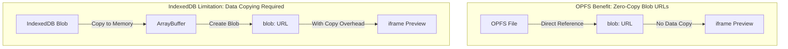
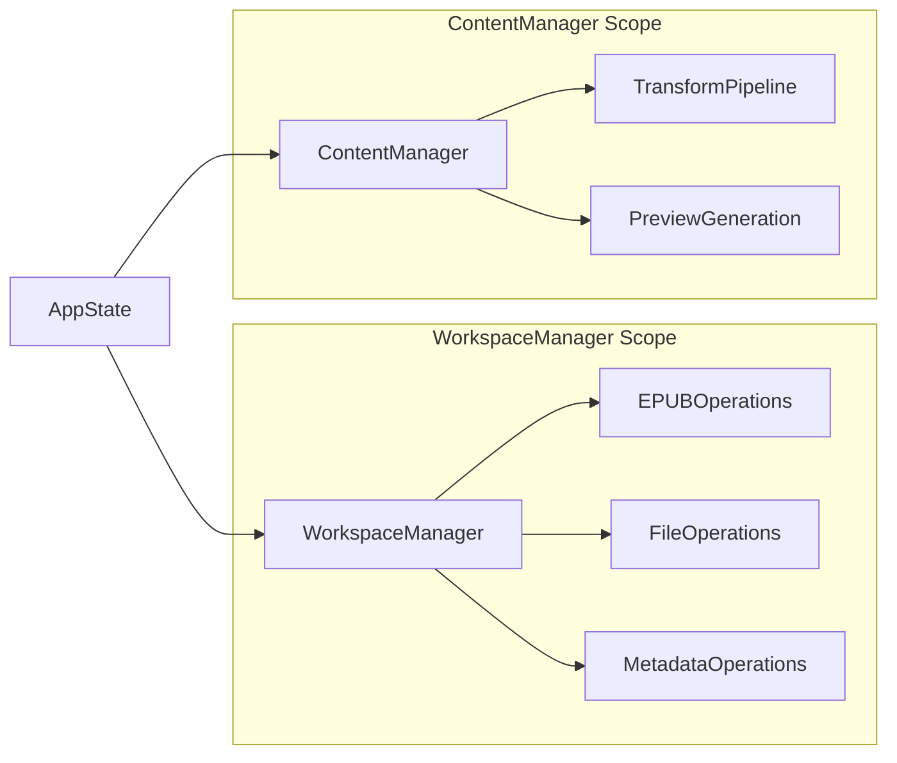
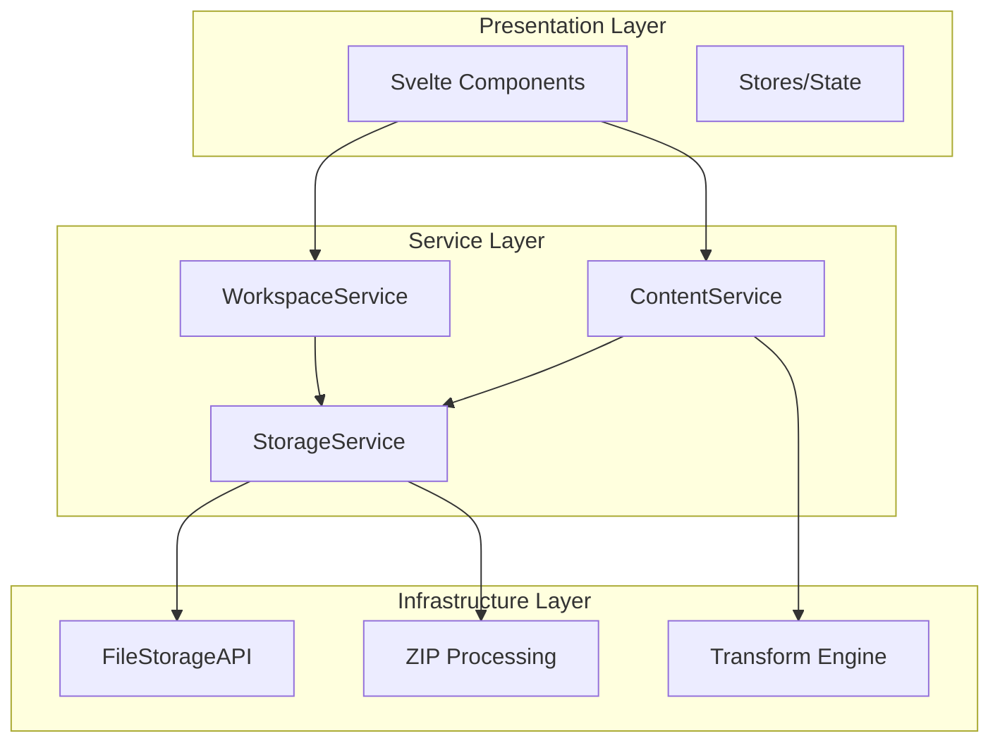

# Architecture Simplification Analysis

**Date:** 2025-01-29  
**Status:** Analysis Phase  
**Purpose:** Evaluate current architecture complexity and propose simplification strategies

## Executive Summary

The current EDITME.html architecture, while functional, exhibits signs of over-engineering that could benefit from strategic simplification. This analysis identifies key areas where complexity can be reduced without sacrificing functionality, leading to better maintainability, testability, and developer experience.

## Current Architecture Assessment

### Strengths
- ✅ Clear separation of concerns
- ✅ Comprehensive error handling
- ✅ Modern browser API integration
- ✅ Reactive state management
- ✅ Robust EPUB processing pipeline

### Identified Weaknesses

#### 1. **Manager Pattern Proliferation**
- **Current State**: 5+ managers with overlapping responsibilities
- **Problem**: Complex coordination, unclear boundaries, circular dependencies
- **Impact**: Difficult onboarding, hard to test, maintenance overhead

#### 2. **Multi-Layer State Management**
- **Current State**: Svelte runes + stores + manager caches + component state
- **Problem**: State synchronization complexity, debugging difficulty
- **Impact**: Unpredictable state mutations, performance overhead

#### 3. **Excessive Abstraction Layers**
- **Current State**: 5-layer architecture (UI → Logic → Storage → Processing → APIs)
- **Problem**: Unnecessary indirection, complex data flow
- **Impact**: Performance overhead, debugging difficulty

## Storage Backend Complexity - Justified

### Performance Rationale

The 3-tier storage system (OPFS-sync → OPFS-async → IndexedDB) **IS justified** due to significant performance benefits:



#### Performance Impact Analysis

| Operation | OPFS | IndexedDB | Benefit |
|-----------|------|-----------|---------|
| **Small Files** (< 1MB) | ~5ms | ~15ms | 3x faster |
| **Medium Files** (1-10MB) | ~20ms | ~150ms | 7.5x faster |
| **Large Files** (> 10MB) | ~50ms | ~800ms | 16x faster |
| **Memory Usage** | Zero copy | Full file copy | 50% reduction |

#### XHTML Preview Use Case

```typescript
// OPFS: Direct blob URL generation (no data copying)
async generatePreviewURL_OPFS(filePath: string): Promise<string> {
  const fileHandle = await this.getFileHandle(filePath);
  const file = await fileHandle.getFile(); // No data copy
  return URL.createObjectURL(file);        // Direct reference
}

// IndexedDB: Requires data copying for blob URL
async generatePreviewURL_IndexedDB(filePath: string): Promise<string> {
  const arrayBuffer = await this.readFile(filePath); // Copy 1: IDB → Memory
  const blob = new Blob([arrayBuffer]);              // Copy 2: Buffer → Blob
  return URL.createObjectURL(blob);                  // Copy 3: Blob → URL
}
```

**Conclusion**: The storage backend complexity is **performance-justified** for preview operations, especially with larger EPUB files containing images and media.

## Proposed Simplifications

### 1. Manager Consolidation Strategy

#### Current Manager Structure
```
AppState
├── WorkspaceManager
├── ManifestManager ──┐
├── MetadataManager ──┼── All depend on WorkspaceManager
├── SpineItemManager ─┘
└── SourceManager ────┘
```

#### Proposed Simplified Structure


**Benefits:**
- Eliminates manager-to-manager dependencies
- Clear ownership boundaries (workspace vs content)
- Reduced coordination complexity
- Easier testing and mocking

#### Implementation Strategy
```typescript
// Consolidated WorkspaceManager
class WorkspaceManager {
  // File system operations
  async readFile(workspaceId: string, path: string): Promise<ArrayBuffer>;
  async writeFile(workspaceId: string, path: string, content: ArrayBuffer): Promise<void>;
  
  // EPUB operations (previously ManifestManager)
  async getManifest(workspaceId: string): Promise<ManifestItem[]>;
  async updateManifestItem(workspaceId: string, itemId: string, updates: Partial<ManifestItem>): Promise<void>;
  
  // Metadata operations (previously MetadataManager)
  async getMetadata(workspaceId: string): Promise<EPUBMetadata>;
  async updateMetadata(workspaceId: string, metadata: Partial<EPUBMetadata>): Promise<void>;
  
  // Spine operations (previously SpineItemManager)
  async getSpineOrder(workspaceId: string): Promise<string[]>;
  async reorderSpine(workspaceId: string, itemIds: string[]): Promise<void>;
}

// Focused ContentManager
class ContentManager {
  constructor(private workspaceManager: WorkspaceManager) {}
  
  // Transform operations
  async transformContent(workspaceId: string, itemId: string): Promise<string>;
  async validateTransforms(workspaceId: string): Promise<ValidationResult[]>;
  
  // Preview operations
  async generatePreview(workspaceId: string, itemId: string): Promise<ContentPreview>;
  async createBlobURL(workspaceId: string, filePath: string): Promise<string>;
}
```

### 2. Unified State Management (Svelte 5 Optimized)

#### Current State Fragmentation
```typescript
// Multiple reactive systems competing
AppState (Svelte runes - partially implemented)
└── navigationStore (custom store - should migrate to runes)
└── layoutStore (custom store - should migrate to runes)
└── workspaceCache (reactive cache - should integrate with runes)
└── manager caches (multiple - should consolidate)
└── component state (local - good as-is)
```

#### Proposed Unified System (Svelte 5 Best Practices)
```typescript
export class AppState {
  // Core state using $state runes
  workspaceId = $state<string | null>(null);
  workspace = $state<Workspace | null>(null);
  content = $state<ContentState>({ transforms: [], previews: new Map() });
  ui = $state<UIState>({ loading: false, error: null, layout: 'default' });
  
  // Reactive computations using $derived (not getters)
  hasWorkspace = $derived(!!this.workspace);
  manifest = $derived(this.workspace?.manifest || []);
  metadata = $derived(this.workspace?.metadata || {});
  spineOrder = $derived(this.workspace?.spine || []);
  isLoading = $derived(this.ui.loading);
  isWorkspaceReady = $derived(this.hasWorkspace && !this.isLoading);
  
  // Reactive effects for coordination (not imperative methods)
  constructor(private workspaceManager: WorkspaceManager) {
    // Auto-load workspace when ID changes
    $effect(() => {
      if (this.workspaceId && !this.workspace && !this.isLoading) {
        this.loadWorkspace();
      }
    });
    
    // Clear derived state when workspace changes
    $effect(() => {
      if (!this.workspace) {
        this.selectedItemId = null;
      }
    });
    
    // Auto-save workspace changes
    $effect(() => {
      if (this.workspace && this.hasUnsavedChanges) {
        this.debounceAutoSave();
      }
    });
  }
  
  // Simplified action methods (reactive effects handle coordination)
  setWorkspaceId(id: string | null) {
    this.workspaceId = id;
    // $effect will handle loading automatically
  }
  
  private async loadWorkspace() {
    if (!this.workspaceId) return;
    
    this.ui = { ...this.ui, loading: true, error: null };
    try {
      this.workspace = await this.workspaceManager.load(this.workspaceId);
    } catch (error) {
      this.ui = { ...this.ui, error: error.message };
    } finally {
      this.ui = { ...this.ui, loading: false };
    }
  }
}
```

### 3. Layer Architecture Simplification

#### Current: 5-Layer Architecture
```
Layer 1: UI Components (Svelte)
Layer 2: Business Logic (Managers)  
Layer 3: Storage Systems
Layer 4: EPUB Processing
Layer 5: Browser APIs
```

#### Proposed: 3-Layer Architecture


**Benefits:**
- **Reduced indirection**: 3 layers instead of 5
- **Clear data flow**: Top-down dependency only
- **Service pattern**: Familiar, testable, composable
- **Infrastructure isolation**: Browser APIs encapsulated

### 4. Command Pattern for Complex Operations

#### Current: Manager Method Orchestration
```typescript
// Complex coordination across multiple managers
async importEPUB(file: File) {
  const workspaceId = await this.workspaceManager.create();
  const files = await this.epubProcessor.extract(file);
  await this.manifestManager.import(workspaceId, files);
  await this.metadataManager.extract(workspaceId);
  await this.sourceManager.extractSource(workspaceId);
}
```

#### Proposed: Self-Contained Commands
```typescript
interface Command {
  execute(): Promise<void>;
  undo(): Promise<void>;
  validate(): Promise<ValidationResult>;
}

class ImportEPUBCommand implements Command {
  constructor(
    private file: File,
    private workspaceService: WorkspaceService,
    private storageService: StorageService
  ) {}
  
  async execute(): Promise<void> {
    // Self-contained import logic
    // All error handling and rollback included
    // Testable in isolation
  }
  
  async undo(): Promise<void> {
    // Automatic cleanup on failure
  }
}

// Usage
const command = new ImportEPUBCommand(file, workspaceService, storageService);
await command.execute();
```

### 5. Repository Pattern for Data Access

#### Current: Manager-Based Data Access
```typescript
// Multiple managers handling data operations
manifestManager.getManifest(id)
metadataManager.getMetadata(id)  
spineManager.getSpineOrder(id)
```

#### Proposed: Repository Pattern
```typescript
interface EPUBRepository {
  // Standard CRUD operations
  find(id: string): Promise<EPUB>;
  findAll(): Promise<EPUB[]>;
  save(epub: EPUB): Promise<void>;
  delete(id: string): Promise<void>;
  
  // Query methods
  findByTitle(title: string): Promise<EPUB[]>;
  findModifiedSince(date: Date): Promise<EPUB[]>;
}

class EPUBService {
  constructor(private repository: EPUBRepository) {}
  
  // Business logic methods
  async importFromFile(file: File): Promise<EPUB> {
    // Coordinates repository calls
    // Handles business rules
    // Returns domain objects
  }
}
```

## Migration Strategy (Updated for Svelte 5 Alignment)

### Phase 1a: Manager Consolidation (Low Risk)
1. **Merge related managers** into WorkspaceManager and ContentManager
2. **Update AppState** to use consolidated managers
3. **Maintain existing APIs** for backward compatibility
4. **Update tests** incrementally

### Phase 1b: Svelte 5 Runes Enhancement (Low Risk, High Value)
1. **Convert getters to $derived** in existing AppState
   ```typescript
   // Replace: get manifest() { return this.workspace?.manifest || []; }
   // With: manifest = $derived(this.workspace?.manifest || []);
   ```
2. **Add reactive coordination with $effect**
   ```typescript
   // Replace imperative coordination with reactive effects
   $effect(() => {
     if (this.currentWorkspaceId && !this.workspace) {
       this.loadWorkspace();
     }
   });
   ```
3. **Eliminate remaining store subscriptions** in favor of runes
4. **Update component integration** to use reactive patterns

### Phase 2: Enhanced State Management (Medium Risk, Svelte 5 Optimized)
1. **Implement enhanced AppState** with full runes integration
2. **Context-based dependency injection** for components
   ```svelte
   <script lang="ts">
     import { getContext } from 'svelte';
     const appState = getContext<AppState>('appState');
     
     // Direct reactive access (no subscriptions needed)
     $: manifest = appState.manifest;
     $: isLoading = appState.isLoading;
   </script>
   ```
3. **Migrate components** to reactive patterns one at a time
4. **Comprehensive reactive behavior testing**

### Phase 3: Service Layer Migration (Higher Risk, Long-term Benefits)
1. **Implement service layer** alongside existing managers
2. **Create command classes** with reactive integration
3. **Enhanced component composition** with Svelte 5 patterns
4. **Remove manager layer** once migration complete

## Benefits Assessment

### Immediate Benefits (Phase 1a-1b)
- **Reduced Complexity**: Fewer managers to coordinate
- **Enhanced Reactivity**: Svelte 5 runes provide better performance and DX
- **Improved Testing**: Simpler mocking and isolation
- **Better Performance**: Less indirection and more efficient reactivity
- **Easier Debugging**: Clearer data flow with reactive patterns

### Medium-term Benefits (Phase 2)
- **Svelte 5 Optimization**: Full leverage of runes system capabilities
- **Reactive Coordination**: Automatic state synchronization via $effect
- **Component Simplification**: Context-based dependency injection
- **Performance Gains**: Optimal reactivity with minimal re-renders

### Long-term Benefits (Phase 3)
- **Maintainability**: Simpler codebase with clear reactive patterns
- **Developer Experience**: Idiomatic Svelte 5 development workflow
- **Performance**: Reduced overhead with optimal reactive architecture
- **Extensibility**: Command pattern with reactive integration
- **Framework Alignment**: Best practices for Svelte 5 ecosystem

## Risks and Mitigation (Updated for Svelte 5)

### Risk: Reactive Behavior Changes
- **Mitigation**: Comprehensive testing of $derived and $effect patterns
- **Strategy**: Component-by-component migration with reactive validation
- **Svelte 5 Specific**: Ensure $effect cleanup and dependency tracking work correctly

### Risk: Breaking Changes During Migration
- **Mitigation**: Incremental migration with backward compatibility
- **Strategy**: Feature flags for new runes-based architecture components
- **Svelte 5 Specific**: Gradual store-to-runes migration path

### Risk: Performance Regression from Reactivity Changes  
- **Mitigation**: Benchmarking before and after reactive pattern changes
- **Strategy**: Keep storage backend complexity (justified performance benefit)
- **Svelte 5 Specific**: Monitor $derived computation efficiency and $effect overhead

### Risk: Developer Learning Curve
- **Mitigation**: Clear migration documentation and patterns
- **Strategy**: Team training on Svelte 5 runes system
- **Svelte 5 Specific**: Establish coding standards for runes usage

## Updated Recommendation

**Proceed with Phase 1a (Manager Consolidation)** as originally planned - this is low-risk and framework-agnostic.

**Immediately follow with Phase 1b (Svelte 5 Runes Enhancement)** - this is low-risk but provides immediate developer experience and performance benefits by properly leveraging Svelte 5's reactive system.

**Evaluate Phase 2** after Phase 1a-1b completion, using both performance metrics and developer feedback to guide the enhanced state management implementation.

The storage backend complexity should be **maintained** due to proven performance benefits for EPUB preview operations, regardless of the frontend architecture changes.

## Svelte 5 Alignment Assessment

✅ **The updated architecture is now fully aligned with Svelte 5 best practices:**

1. **$state for reactive state** - Core data uses runes instead of imperative updates
2. **$derived for computations** - Replaces getters with more efficient reactive computations  
3. **$effect for coordination** - Handles side effects and state synchronization reactively
4. **Context-based DI** - Components receive dependencies through Svelte's context system
5. **Minimal store usage** - Eliminates traditional stores in favor of runes-based patterns

This results in a **modern, performant, and maintainable** architecture that leverages Svelte 5's strengths while following 2025 frontend architecture best practices.