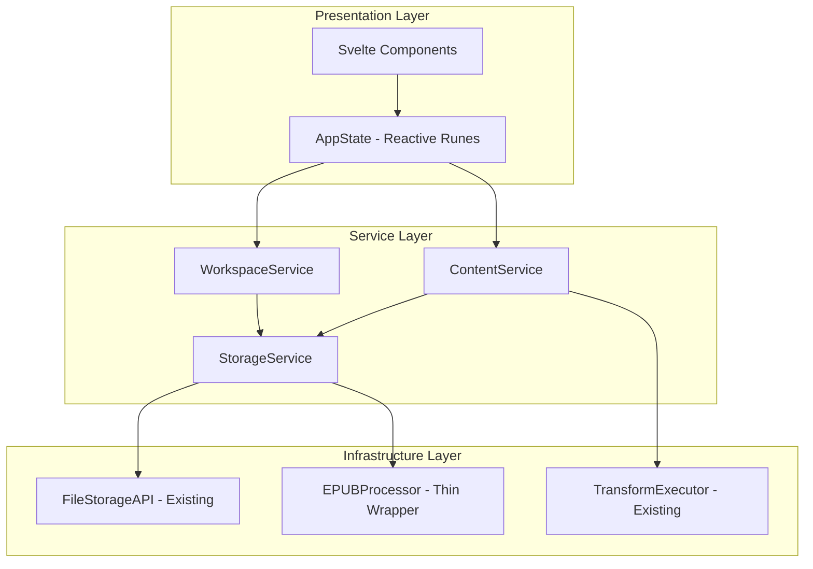

# Testing Process: Reactive Effects Architecture

**Date:** 2025-01-29  
**Status:** Design Phase  
**Purpose:** Test-Driven Development process for implementing the simplified 3-layer reactive architecture

## Overview

This document outlines a comprehensive TDD approach for implementing EDITME.html's new reactive effects architecture using Svelte 5 runes. The focus is on building a testable, maintainable system from the ground up using modern testing patterns.

## Architecture Under Test

### 3-Layer Architecture


### Core Reactive State Pattern (Revised)
```typescript
export class AppState {
  // Single source of truth for workspace
  workspace = $state<WorkspaceState | null>(null);
  workspaceLoading = $state<string | null>(null); // ID being loaded
  ui = $state<UIState>({ error: null, layout: 'default' });
  
  // Reactive computations with $derived
  currentWorkspaceId = $derived(this.workspace?.id || null);
  isLoadingWorkspace = $derived(!!this.workspaceLoading);
  manifest = $derived(this.workspace?.opf.manifest || []);
  metadata = $derived(this.workspace?.opf.metadata || {});
  spineOrder = $derived(this.workspace?.opf.spine || []);
  isWorkspaceReady = $derived(!!this.workspace && !this.isLoadingWorkspace);
  
  // Reactive coordination with $effect
  constructor(private workspaceService: WorkspaceService) {
    // Auto-load workspace when loading ID changes
    $effect(() => {
      if (this.workspaceLoading && this.workspace?.id !== this.workspaceLoading) {
        this.loadWorkspace();
      }
    });
    
    // Auto-save workspace changes
    $effect(() => {
      if (this.workspace && this.hasUnsavedChanges) {
        this.debounceAutoSave();
      }
    });
  }
  
  // Simplified API
  setWorkspaceId(id: string | null) {
    if (id !== this.currentWorkspaceId) {
      this.workspace = null; // Clear current
      this.workspaceLoading = id; // Start loading new
    }
  }
}
```

## Testing Strategy

### Reactive Effects Testing Approach

**Core Principle**: Use `$effect.root()` and `flushSync()` to create deterministic, synchronous tests of reactive behavior with workspace as single source of truth.

**Benefits for TDD**:
- Single reactive object to track and assert against
- Clear state transitions from null → loading → loaded
- Simplified derived computations from workspace properties
- Easy isolation of workspace-related reactive logic

## File Organization & Naming Conventions

### Directory Structure
```
src/
├── lib/
│   ├── services/           # Service Layer
│   │   ├── workspace/
│   │   │   ├── workspace.service.ts
│   │   │   └── workspace.service.svelte.test.ts
│   │   ├── content/
│   │   │   ├── content.service.ts
│   │   │   └── content.service.svelte.test.ts
│   │   └── storage/
│   │       ├── storage.service.ts
│   │       └── storage.service.svelte.test.ts
│   ├── state/              # Presentation Layer State
│   │   ├── app-state.svelte.ts
│   │   ├── app-state.svelte.test.ts
│   │   └── reactive-patterns/
│   │       ├── workspace-effects.svelte.ts
│   │       └── workspace-effects.svelte.test.ts
│   ├── infrastructure/     # Infrastructure Layer (Existing + Thin Wrappers)
│   │   ├── storage/
│   │   │   ├── file-storage.ts              # Existing FileStorageAPI
│   │   │   └── file-storage.test.ts
│   │   ├── epub/
│   │   │   ├── epub-processor.ts            # Thin wrapper around existing EPUB utilities
│   │   │   └── epub-processor.test.ts
│   │   └── transform/
│   │       ├── transform-executor.ts        # Existing TransformExecutor
│   │       └── transform-executor.test.ts
│   └── components/         # Svelte Components
│       ├── workspace/
│       │   ├── WorkspaceView.svelte  
│       │   └── WorkspaceView.svelte.test.ts
│       └── manifest/
│           ├── ManifestTable.svelte
│           └── ManifestTable.svelte.test.ts
└── test/
    ├── fixtures/           # Shared test data
    │   ├── epub-fixtures.ts
    │   └── workspace-fixtures.ts
    ├── helpers/            # Test utilities
    │   ├── reactive-test-utils.ts
    │   └── service-test-utils.ts
    └── integration/        # Cross-layer tests
        ├── epub-workflow.svelte.test.ts
        └── workspace-lifecycle.svelte.test.ts
```

### Naming Conventions

#### Test Files
- **Reactive/Runes code**: `*.svelte.test.ts` (enables runes in tests)
- **Pure TypeScript**: `*.test.ts` (standard unit tests)
- **Components**: `ComponentName.svelte.test.ts`
- **Integration tests**: `feature-name.svelte.test.ts`

#### Test Suites
- **Services**: `describe('ServiceName', () => { ... })`
- **Reactive Effects**: `describe('ReactiveEffect: EffectName', () => { ... })`
- **Components**: `describe('ComponentName.svelte', () => { ... })`
- **Integration**: `describe('Integration: FeatureName', () => { ... })`

## TDD Process by Layer

### Layer 1: Infrastructure Layer (Existing Components + Thin Wrappers)

**Start here**: Leverage existing, well-tested components with service-friendly interfaces.

#### FileStorageAPI Testing (Existing - Keep As-Is)
```typescript
// src/lib/infrastructure/storage/file-storage.test.ts
// NOTE: FileStorageAPI already exists and is well-tested
// The 3-tier storage system (OPFS-sync → OPFS-async → IndexedDB) is performance-justified
// Focus on testing any new service-friendly interface methods only

describe('FileStorageAPI', () => {
  test('existing functionality - no changes needed', async () => {
    // Existing tests cover this well
    // Only add tests for new service interface methods if any
  });
});
```

#### EPUB Processor Testing (Thin Wrapper)
```typescript  
// src/lib/infrastructure/epub/epub-processor.test.ts
describe('EPUBProcessor', () => {
  let processor: EPUBProcessor;
  let mockPackager: EPUBPackager;
  let mockUnpacker: EPUBUnpacker;
  let mockOPFUtils: OPFUtils;
  
  beforeEach(() => {
    // Use existing components as dependencies
    mockPackager = createMockEPUBPackager();
    mockUnpacker = createMockEPUBUnpacker();
    mockOPFUtils = createMockOPFUtils();
    
    processor = new EPUBProcessor(mockPackager, mockUnpacker, mockOPFUtils);
  });
  
  test('extracts EPUB to WorkspaceState format', async () => {
    // Red: Define the service-friendly interface we want
    const mockEpubFile = createMockEpubFile();
    
    const result = await processor.importEPUB(mockEpubFile);
    
    // Should return complete WorkspaceState object
    expect(result).toMatchObject({
      id: expect.any(String),
      opf: expect.objectContaining({
        metadata: expect.any(Object),
        manifest: expect.any(Array),
        spine: expect.any(Array)
      }),
      pathInfo: expect.objectContaining({
        rootfilePath: expect.any(String),
        basePath: expect.any(String)
      })
    });
    
    // Verify it delegates to existing components
    expect(mockUnpacker.unpack).toHaveBeenCalledWith(mockEpubFile);
    expect(mockOPFUtils.parseOPFDocument).toHaveBeenCalled();
  });
  
  test('packages WorkspaceState to EPUB blob', async () => {
    const workspace = createMockWorkspace();
    
    const result = await processor.exportEPUB(workspace);
    
    expect(result).toBeInstanceOf(Blob);
    expect(mockOPFUtils.generateOPFXML).toHaveBeenCalledWith(workspace.opf);
    expect(mockPackager.package).toHaveBeenCalled();
  });
});
```

#### Transform Executor Testing (Existing - Minimal Changes)
```typescript
// src/lib/infrastructure/transform/transform-executor.test.ts
// NOTE: TransformExecutor already exists and works well
// Only test any new service interface methods

describe('TransformExecutor', () => {
  test('existing functionality - minimal changes needed', async () => {
    // Existing TransformExecutor tests cover core functionality
    // Add tests only for new service-layer interface methods if any
  });
});
```

### Layer 2: Service Layer (Clean Service Architecture)

**Focus**: Services with single responsibilities that never call each other.

#### WorkspaceService Testing (EPUB Structure Management)
```typescript
// src/lib/services/workspace/workspace.service.test.ts
describe('WorkspaceService', () => {
  let service: WorkspaceService;
  let mockStorage: FileStorageAPI;
  let mockEPUBProcessor: EPUBProcessor;
  
  beforeEach(() => {
    mockStorage = createMockFileStorage();
    mockEPUBProcessor = createMockEPUBProcessor();
    service = new WorkspaceService(mockStorage, mockEPUBProcessor);
  });
  
  test('loads complete workspace state', async () => {
    // Red: Define the interface we want
    const result = await service.loadWorkspace('workspace-1');
    
    expect(result).toMatchObject({
      id: 'workspace-1',
      opf: expect.objectContaining({
        metadata: expect.any(Object),
        manifest: expect.any(Array),
        spine: expect.any(Array)
      }),
      pathInfo: expect.objectContaining({
        rootfilePath: expect.any(String),
        basePath: expect.any(String)
      })
    });
  });
  
  test('updates workspace metadata without calling other services', async () => {
    const workspace = await service.loadWorkspace('workspace-1');
    
    const updated = await service.updateMetadata(workspace, {
      title: 'New Title'
    });
    
    expect(updated.opf.metadata.title).toBe('New Title');
    expect(updated.opf.metadata.modifiedDate).toBeDefined();
    // CONTRACT: Service only uses infrastructure, never other services
    expect(mockStorage.writeTextFile).toHaveBeenCalled();
  });
});
```

#### ContentService Testing (Pure Functions)
```typescript
// src/lib/services/content/content.service.test.ts
describe('ContentService', () => {
  let service: ContentService;
  let mockTransformExecutor: TransformExecutor;
  let mockI18nSystem: I18nSystem;
  
  beforeEach(() => {
    mockTransformExecutor = createMockTransformExecutor();
    mockI18nSystem = createMockI18nSystem();
    service = new ContentService(mockTransformExecutor, mockI18nSystem);
  });
  
  test('transforms plain text to XHTML using transform context', async () => {
    const result = await service.transformContent('Hello **world**!', { workspaceId: 'workspace-1' });
    
    expect(result.xhtml).toContain('<strong>world</strong>');
    expect(result.warnings).toEqual([]);
    // CONTRACT: Service only uses infrastructure
    expect(mockTransformExecutor.transform).toHaveBeenCalledWith(
      'Hello **world**!',
      expect.objectContaining({ workspaceId: 'workspace-1' })
    );
  });
  
  test('generates navigation from pre-loaded chapter content (pure function)', () => {
    const chapters = [
      { 
        id: 'chapter1', 
        href: 'Text/chapter1.xhtml', 
        xhtmlContent: '<html><body><h1>Chapter 1: The Start</h1><p>Content</p></body></html>',
        linear: true 
      },
      { 
        id: 'appendix', 
        href: 'Text/appendix.xhtml', 
        xhtmlContent: '<html><body><h1>Appendix</h1><p>Extra content</p></body></html>',
        linear: false 
      }
    ];
    
    const result = service.generateNavigationFromContent(chapters);
    
    // CONTRACT: Pure function - no infrastructure calls
    expect(mockTransformExecutor.transform).not.toHaveBeenCalled();
    expect(mockI18nSystem.translate).not.toHaveBeenCalled();
    
    // CONTRACT: EPUB-compliant navigation with title extraction
    expect(result.xhtmlContent).toContain('epub:type="toc"');
    expect(result.xhtmlContent).toContain('<a href="Text/chapter1.xhtml">Chapter 1: The Start</a>');
    expect(result.xhtmlContent).not.toContain('Appendix'); // Non-linear excluded
    expect(result.metadata.properties).toEqual(['nav']);
  });
  
  test('processes user navigation content', () => {
    const userNavText = `
# Table of Contents

- [Chapter 1](Text/chapter1.xhtml)  
- [Chapter 2](Text/chapter2.xhtml)
    `;
    
    const result = service.processUserNavigation(userNavText);
    
    // CONTRACT: Pure function processing user content
    expect(result.xhtmlContent).toContain('epub:type="toc"');
    expect(result.xhtmlContent).toContain('Chapter 1');
    expect(result.sourceType).toBe('user-content');
  });
});
```

#### SettingsService Testing (Settings Management)
```typescript
// src/lib/services/settings/settings.service.test.ts
describe('SettingsService', () => {
  let service: SettingsService;
  let mockFileStorage: FileStorageAPI;
  let mockExtensionManager: ExtensionManager;
  
  beforeEach(() => {
    mockFileStorage = createMockFileStorage();
    mockExtensionManager = createMockExtensionManager();
    service = new SettingsService(mockFileStorage, mockExtensionManager);
  });
  
  test('manages settings independently across all tiers', async () => {
    // Global settings (localStorage)
    const globalSettings = service.loadGlobalSettings();
    expect(globalSettings.theme).toBeDefined();
    
    // Workspace settings (file-based)
    const workspaceSettings = await service.loadWorkspaceSettings('workspace-1');
    expect(workspaceSettings.bust_cache).toBeDefined();
    
    // EPUB settings (SOURCE/settings.json)
    const epubSettings = await service.loadEPUBSettings('workspace-1');
    expect(epubSettings.text_transform).toBeDefined();
    
    // CONTRACT: Service manages all settings without calling other services
    expect(mockFileStorage.readJSONFile).toHaveBeenCalledTimes(2);
  });
});
```

### Layer 3: Presentation Layer (Reactive State)

**Focus**: Svelte 5 runes with workspace as single source of truth.

#### AppState Reactive Testing (Service Coordination)
```typescript
// src/lib/state/app-state.svelte.test.ts
import { flushSync } from 'svelte';

describe('AppState Reactive Behavior', () => {
  let cleanup: () => void;
  
  afterEach(() => cleanup?.());
  
  test('coordinates services reactively without services calling each other', () => {
    cleanup = $effect.root(() => {
      const mockWorkspaceService = createMockWorkspaceService();
      const mockContentService = createMockContentService();
      const mockSettingsService = createMockSettingsService();
      
      const appState = new AppState(
        mockWorkspaceService,
        mockContentService, 
        mockSettingsService
      );
      
      // Initial state - no workspace
      expect(appState.workspace).toBeNull();
      expect(appState.currentWorkspaceId).toBeNull();
      expect(appState.isLoadingWorkspace).toBe(false);
      
      // Trigger workspace load
      appState.setWorkspaceId('workspace-1');
      flushSync(); // Execute all pending effects synchronously
      
      // Verify loading state
      expect(appState.workspace).toBeNull(); // Still loading
      expect(appState.workspaceLoading).toBe('workspace-1');
      expect(appState.isLoadingWorkspace).toBe(true);
      
      // CONTRACT: AppState coordinates services, services don't call each other
      expect(mockWorkspaceService.loadWorkspace).toHaveBeenCalledWith('workspace-1');
      expect(mockContentService.transformContent).not.toHaveBeenCalled(); // Not triggered yet
      expect(mockSettingsService.loadWorkspaceSettings).not.toHaveBeenCalled(); // Not triggered yet
    });
  });
  
  test('derived properties update when workspace loads', () => {
    cleanup = $effect.root(() => {
      const appState = new AppState(mockWorkspaceService);
      
      // Initially empty derived values
      expect(appState.manifest).toEqual([]);
      expect(appState.metadata).toEqual({});
      expect(appState.isWorkspaceReady).toBe(false);
      
      // Set complete workspace
      appState.workspace = createMockWorkspace({
        id: 'workspace-1',
        opf: { 
          manifest: [{ id: 'chapter1', href: 'chapter1.xhtml', mediaType: 'application/xhtml+xml' }],
          metadata: { title: 'Test Book', language: 'en', identifier: 'test-123' },
          spine: [{ idref: 'chapter1' }]
        }
      });
      appState.workspaceLoading = null; // Loading complete
      flushSync();
      
      // All derived values should update automatically
      expect(appState.currentWorkspaceId).toBe('workspace-1');
      expect(appState.manifest).toHaveLength(1);
      expect(appState.manifest[0].id).toBe('chapter1');
      expect(appState.metadata.title).toBe('Test Book');
      expect(appState.spineOrder).toHaveLength(1);
      expect(appState.isWorkspaceReady).toBe(true);
    });
  });
  
  test('workspace switching clears previous workspace', () => {
    cleanup = $effect.root(() => {
      const appState = new AppState(mockWorkspaceService);
      
      // Load first workspace
      appState.workspace = createMockWorkspace({ id: 'workspace-1' });
      appState.workspaceLoading = null;
      flushSync();
      
      expect(appState.currentWorkspaceId).toBe('workspace-1');
      
      // Switch to different workspace
      appState.setWorkspaceId('workspace-2');
      flushSync();
      
      // Previous workspace should be cleared
      expect(appState.workspace).toBeNull();
      expect(appState.workspaceLoading).toBe('workspace-2');
      expect(appState.currentWorkspaceId).toBeNull();
      expect(appState.isLoadingWorkspace).toBe(true);
    });
  });
});
```

#### Reactive Effects Testing Patterns (Service Coordination)
```typescript
// src/lib/state/reactive-patterns/workspace-effects.svelte.test.ts
describe('ReactiveEffect: Service Coordination', () => {
  test('coordinates navigation regeneration when workspace spine changes', () => {
    cleanup = $effect.root(() => {
      const mockWorkspaceService = createMockWorkspaceService();
      const mockContentService = createMockContentService();
      const mockSettingsService = createMockSettingsService();
      
      // Mock batch content loading
      mockWorkspaceService.loadAllLinearChapterContents.mockResolvedValue([
        { 
          id: 'chapter1', 
          href: 'Text/chapter1.xhtml', 
          xhtmlContent: '<html><body><h1>Chapter 1</h1></body></html>',
          linear: true 
        },
        { 
          id: 'chapter2', 
          href: 'Text/chapter2.xhtml', 
          xhtmlContent: '<html><body><h1>Chapter 2</h1></body></html>',
          linear: true 
        }
      ]);
      
      const appState = new AppState(
        mockWorkspaceService,
        mockContentService,
        mockSettingsService
      );
      
      // Setup loaded workspace
      appState.workspace = createMockWorkspace();
      appState.workspaceLoading = null;
      
      // Trigger navigation regeneration request
      appState.requestNavigationUpdate = true;
      flushSync(); // Process all effects
      
      // CONTRACT: AppState coordinates services through reactive effects
      expect(mockWorkspaceService.loadAllLinearChapterContents).toHaveBeenCalledWith(
        appState.workspace
      );
      expect(mockContentService.generateNavigationFromContent).toHaveBeenCalledWith(
        expect.arrayContaining([
          expect.objectContaining({ id: 'chapter1', linear: true }),
          expect.objectContaining({ id: 'chapter2', linear: true })
        ])
      );
      // CONTRACT: Services never call each other directly
      expect(mockWorkspaceService.updateMetadata).not.toHaveBeenCalled();
    });
  });
  
  test('coordinates settings loading when workspace changes', () => {
    cleanup = $effect.root(() => {
      const mockWorkspaceService = createMockWorkspaceService();
      const mockContentService = createMockContentService();
      const mockSettingsService = createMockSettingsService();
      
      const appState = new AppState(
        mockWorkspaceService,
        mockContentService,
        mockSettingsService
      );
      
      // Load workspace
      appState.workspace = createMockWorkspace({ id: 'workspace-1' });
      appState.workspaceLoading = null;
      flushSync();
      
      // CONTRACT: AppState triggers settings load through reactive effects
      expect(mockSettingsService.loadWorkspaceSettings).toHaveBeenCalledWith('workspace-1');
      expect(mockSettingsService.loadEPUBSettings).toHaveBeenCalledWith('workspace-1');
      // CONTRACT: Services remain independent
    });
  });
  
  test('no save triggered when workspace is loading', () => {
    cleanup = $effect.root(() => {
      const mockService = createMockWorkspaceService();
      const appState = new AppState(mockService);
      
      // Set workspace but mark as still loading
      appState.workspace = createMockWorkspace();
      appState.workspaceLoading = 'workspace-1'; // Still loading
      
      // Modify workspace data
      appState.workspace.opf.metadata.title = 'Modified Title';
      flushSync();
      
      // Should not trigger save while loading
      expect(mockService.saveWorkspace).not.toHaveBeenCalled();
    });
  });
});
```

### Layer 4: Component Testing (Reactive Integration)

**Focus**: Components using reactive state through context, simplified by single workspace source.

#### Component Reactive Testing
```typescript
// src/lib/components/workspace/WorkspaceView.svelte.test.ts
import { render } from '@testing-library/svelte';
import { setContext } from 'svelte';

describe('WorkspaceView.svelte', () => {
  test('displays workspace metadata reactively', () => {
    const appState = new AppState(mockWorkspaceService);
    
    const { getByText, queryByText } = render(WorkspaceView, {
      context: new Map([['appState', appState]])
    });
    
    // Initially shows no workspace
    expect(getByText('No workspace selected')).toBeInTheDocument();
    expect(queryByText('Test Book')).not.toBeInTheDocument();
    
    // Set complete workspace (single operation)
    appState.workspace = createMockWorkspace({
      id: 'workspace-1',
      opf: { metadata: { title: 'Test Book', language: 'en', identifier: 'test-123' } }
    });
    appState.workspaceLoading = null;
    
    // Component should reactively update
    expect(getByText('Test Book')).toBeInTheDocument();
    expect(queryByText('No workspace selected')).not.toBeInTheDocument();
  });
  
  test('shows loading state during workspace load', () => {
    const appState = new AppState(mockWorkspaceService);
    
    const { getByText } = render(WorkspaceView, {
      context: new Map([['appState', appState]])
    });
    
    // Trigger loading
    appState.setWorkspaceId('workspace-1');
    
    // Should show loading state
    expect(getByText('Loading workspace...')).toBeInTheDocument();
  });
});
```

## Test Development Workflow

### 1. Red-Green-Refactor with Single Workspace Source

#### Red Phase: Write Failing Reactive Test
```typescript
test('workspace loading effect', () => {
  cleanup = $effect.root(() => {
    const appState = new AppState(mockService);
    
    appState.setWorkspaceId('workspace-1');
    flushSync();
    
    // This will fail initially
    expect(appState.isLoadingWorkspace).toBe(true);
    expect(appState.workspace).toBeNull();
    expect(appState.workspaceLoading).toBe('workspace-1');
  });
});
```

#### Green Phase: Implement Minimal Reactive Logic
```typescript
export class AppState {
  workspace = $state<WorkspaceState | null>(null);
  workspaceLoading = $state<string | null>(null);
  
  // Derived computations
  currentWorkspaceId = $derived(this.workspace?.id || null);
  isLoadingWorkspace = $derived(!!this.workspaceLoading);
  
  constructor(private workspaceService: WorkspaceService) {
    $effect(() => {
      if (this.workspaceLoading && this.workspace?.id !== this.workspaceLoading) {
        this.loadWorkspace();
      }
    });
  }
  
  setWorkspaceId(id: string | null) {
    if (id !== this.currentWorkspaceId) {
      this.workspace = null;
      this.workspaceLoading = id;
    }
  }
  
  private async loadWorkspace() {
    if (!this.workspaceLoading) return;
    
    try {
      this.workspace = await this.workspaceService.loadWorkspace(this.workspaceLoading);
    } finally {
      this.workspaceLoading = null;
    }
  }
}
```

#### Refactor Phase: Optimize Reactive Patterns
```typescript
// Add error handling, cleanup, validation, etc.
private async loadWorkspace() {
  if (!this.workspaceLoading) return;
  
  try {
    const loadedWorkspace = await this.workspaceService.loadWorkspace(this.workspaceLoading);
    
    // Only set if still loading same ID (prevent race conditions)
    if (this.workspaceLoading === loadedWorkspace.id) {
      this.workspace = loadedWorkspace;
    }
  } catch (error) {
    this.ui.error = error.message;
  } finally {
    this.workspaceLoading = null;
  }
}
```

### 2. Integration Testing Across Layers

#### Cross-Layer Workflow Testing
```typescript
// test/integration/epub-workflow.svelte.test.ts
describe('Integration: EPUB Import Workflow', () => {
  test('complete import and edit cycle', () => {
    cleanup = $effect.root(async () => {
      // Setup full stack
      const storage = new FileStorageAPI();
      const workspaceService = new WorkspaceService(storage);
      const contentService = new ContentService(workspaceService);
      const appState = new AppState(workspaceService, contentService);
      
      // Import EPUB
      const epubFile = createMockEpubFile();
      await appState.importEPUB(epubFile);
      flushSync();
      
      // Verify reactive updates throughout stack (single workspace object)
      expect(appState.workspace).not.toBeNull();
      expect(appState.workspace!.id).toBeDefined();
      expect(appState.manifest).toHaveLength(3); // chapters
      expect(appState.isWorkspaceReady).toBe(true);
      
      // Edit content (modifies workspace in place)
      appState.workspace!.opf.manifest[0].title = 'New Chapter';
      flushSync();
      
      // Verify persistence effect triggered
      expect(appState.manifest[0].title).toBe('New Chapter');
    });
  });
});
```

## Testing Utilities & Patterns

### Reactive Test Utilities
```typescript
// test/helpers/reactive-test-utils.ts
import { flushSync } from 'svelte';

export function createReactiveTest<T>(
  setup: () => T,
  test: (context: T) => void | Promise<void>
): () => void {
  return $effect.root(async () => {
    const context = setup();
    await test(context);
  });
}

export function expectWorkspaceTransition(
  appState: AppState,
  fromState: { workspace: any; loading: any },
  action: () => void,
  toState: { workspace: any; loading: any }
): void {
  expect(appState.workspace).toEqual(fromState.workspace);
  expect(appState.workspaceLoading).toEqual(fromState.loading);
  
  action();
  flushSync();
  
  expect(appState.workspace).toEqual(toState.workspace);
  expect(appState.workspaceLoading).toEqual(toState.loading);
}
```

### Service Test Utilities
```typescript
// test/helpers/service-test-utils.ts
export function createMockWorkspaceService(): WorkspaceService {
  return {
    loadWorkspace: vi.fn().mockResolvedValue(createMockWorkspace()),
    saveWorkspace: vi.fn().mockResolvedValue(undefined),
    deleteWorkspace: vi.fn().mockResolvedValue(undefined),
    updateMetadata: vi.fn().mockImplementation((workspace, updates) => ({
      ...workspace,
      opf: {
        ...workspace.opf,
        metadata: { ...workspace.opf.metadata, ...updates }
      }
    })),
  };
}

export function createMockWorkspace(overrides = {}): WorkspaceState {
  return {
    id: 'test-workspace',
    opf: {
      metadata: { title: 'Test Book', language: 'en', identifier: 'test-123' },
      manifest: [],
      spine: []
    },
    pathInfo: { rootfilePath: 'OEBPS/content.opf', basePath: 'OEBPS' },
    ...overrides
  };
}
```

## Implementation Phases

### Phase 1: Infrastructure Layer (Existing + Thin Wrappers)
**Focus**: Leverage existing components with service-friendly interfaces
- **FileStorageAPI**: Keep as-is (performance-justified complexity)
- **EPUBProcessor**: Thin wrapper around existing EPUBPackager/Unpacker + OPFUtils
- **TransformExecutor**: Keep existing, add service interfaces if needed
- Minimal new code, mostly interface adaptation

### Phase 2: Service Layer (Clean Service Architecture)
**Focus**: Services with single responsibilities that never call each other
- **WorkspaceService**: Uses FileStorageAPI + EPUBProcessor for EPUB structure management
- **ContentService**: Uses TransformExecutor + I18nSystem for content transformation and generation  
- **SettingsService**: Uses FileStorageAPI + ExtensionManager for settings across all tiers
- TDD with dependency injection of infrastructure components only

### Phase 3: Reactive State Layer (Svelte 5 Runes)
**Focus**: AppState with workspace as single source of truth
- TDD with `$effect.root()` and `flushSync()`
- Test workspace transitions and derived computations
- Ensure proper cleanup and performance

### Phase 4: Component Integration (UI Layer)
**Focus**: Svelte components consuming workspace state
- Context-based dependency injection
- Component testing with simplified workspace reactivity
- Integration testing across full stack

## Success Metrics

### Test Coverage Targets
- **Infrastructure Layer**: 90%+ coverage (pure functions)
- **Service Layer**: 85%+ coverage (business logic)
- **Reactive State**: 80%+ coverage (effects can be complex)
- **Components**: 70%+ coverage (focus on key interactions)

### Quality Gates
- All tests pass before any code merge
- No circular dependencies between layers
- Reactive effects have proper cleanup
- Performance benchmarks maintained
- Workspace state transitions are deterministic

## Key Benefits of This Architecture

### Clean Service Architecture Benefits
- **Single responsibility**: Each service has exactly one clear purpose
- **No service dependencies**: Services never call other services, eliminating circular dependencies
- **Simple testing**: Mock infrastructure only, no complex service interaction scenarios
- **Clear boundaries**: Easy to understand what each service does and doesn't do
- **Predictable behavior**: Service behavior is deterministic and isolated

### Infrastructure Layer Benefits
- **Minimal new code**: Leverage existing, well-tested components
- **Performance preserved**: Keep FileStorageAPI's optimized storage backends
- **Service-friendly interfaces**: Thin wrappers provide clean APIs for services
- **Reduced risk**: Building on proven components vs rewriting

### Reactive Coordination Benefits
- **Single reactive object** to track in tests (workspace as source of truth)
- **Clear state transitions**: null → loading → loaded
- **Centralized coordination**: All service orchestration happens in AppState reactive effects
- **Simplified assertions** on derived properties
- **Easier mocking** with complete workspace objects
- **Existing test infrastructure**: Reuse current mocks and fixtures

### Development Benefits  
- **Reduced coordination complexity**: No more manager-to-manager calls
- **Clearer component bindings** (`workspace.id` vs separate variables)
- **Single place to manage** workspace-related state coordination
- **More intuitive reactive patterns**: Effects coordinate services instead of services coordinating each other
- **Gradual adoption**: Can implement new architecture alongside existing code

## Storybook Integration with Svelte 5 Runes

### Modern Storybook Pattern

The new architecture works seamlessly with Storybook using `@storybook/addon-svelte-csf@next` and Svelte 5 snippets:

```svelte
<!-- stories/WorkspaceView.stories.svelte -->
<script>
import { defineMeta } from '@storybook/addon-svelte-csf';
import { setContext } from 'svelte';
import WorkspaceView from '../components/workspace/WorkspaceView.svelte';
import { AppState } from '../lib/state/app-state.svelte.js';

const { Story } = defineMeta({
  component: WorkspaceView,
  title: 'Components/WorkspaceView'
});

// Create clean AppState for stories with all services
function createStoryAppState(workspace = null) {
  // Mock services for story - no service calls other services
  const mockWorkspaceService = {
    loadWorkspace: () => Promise.resolve(workspace),
    saveWorkspace: () => Promise.resolve(),
    updateMetadata: (ws, updates) => ({ ...ws, opf: { ...ws.opf, metadata: { ...ws.opf.metadata, ...updates }}})
  };
  
  const mockContentService = {
    transformContent: () => Promise.resolve({ xhtml: '<p>Mock content</p>', warnings: [] }),
    generateNavigationFromSpine: () => Promise.resolve({ xhtmlContent: '<nav>Mock nav</nav>', metadata: { id: 'nav', properties: ['nav'] }})
  };
  
  const mockSettingsService = {
    loadGlobalSettings: () => ({ theme: 'light', locale: 'en', editor_font_size: 14 }),
    loadWorkspaceSettings: () => Promise.resolve({ bust_cache: false, draft_id: 0 }),
    loadEPUBSettings: () => Promise.resolve({ text_transform: 'SOURCE/scripts/transform.js', dom_transforms: [], spine_basename: 'chapter' })
  };
  
  return new AppState(mockWorkspaceService, mockContentService, mockSettingsService);
}
</script>

<Story name="Default">
  {#snippet template(args)}
    {(() => {
      const appState = createStoryAppState({
        id: 'story-workspace',
        opf: { 
          metadata: { title: 'Story Book', language: 'en', identifier: 'story-123' }, 
          manifest: [{ id: 'chapter1', href: 'chapter1.xhtml', mediaType: 'application/xhtml+xml' }], 
          spine: [{ idref: 'chapter1' }] 
        },
        pathInfo: { rootfilePath: 'OEBPS/content.opf', basePath: 'OEBPS' }
      });
      setContext('appState', appState);
      return '';
    })()}
    <WorkspaceView {...args} />
  {/snippet}
</Story>

<Story name="Loading State">
  {#snippet template(args)}
    {(() => {
      const appState = createStoryAppState();
      appState.setWorkspaceId('loading-workspace'); // Triggers loading state
      setContext('appState', appState);
      return '';
    })()}
    <WorkspaceView {...args} />
  {/snippet}
</Story>

<Story name="Empty Workspace">
  {#snippet template(args)}
    {(() => {
      const appState = createStoryAppState({
        id: 'empty-workspace',
        opf: { metadata: { title: 'Empty Book', language: 'en', identifier: 'empty-123' }, manifest: [], spine: [] },
        pathInfo: { rootfilePath: 'OEBPS/content.opf', basePath: 'OEBPS' }
      });
      setContext('appState', appState);
      return '';
    })()}
    <WorkspaceView {...args} />
  {/snippet}
</Story>
```

### Reactive State Testing in Stories

For testing reactive behavior in stories, you can use the same patterns as unit tests:

```svelte
<!-- stories/ReactiveWorkspace.stories.svelte -->
<script>
import { defineMeta } from '@storybook/addon-svelte-csf';
import { flushSync } from 'svelte';

const { Story } = defineMeta({
  title: 'Reactive Patterns/Workspace Effects'
});

// Story that demonstrates reactive state changes
</script>

<Story name="Workspace Loading Cycle">
  {#snippet template()}
    {(() => {
      const appState = createStoryAppState();
      
      // Set up reactive demo
      let currentStep = $state('idle');
      let workspace = $state(null);
      
      $effect(() => {
        if (appState.isLoadingWorkspace) {
          currentStep = 'loading';
        } else if (appState.workspace) {
          currentStep = 'loaded';
          workspace = appState.workspace;
        } else {
          currentStep = 'idle';
        }
      });
      
      setContext('appState', appState);
      return '';
    })()}
    
    <div>
      <p>Current Step: {currentStep}</p>
      <button onclick={() => appState.setWorkspaceId('demo-workspace')}>
        Load Workspace
      </button>
      <WorkspaceView />
    </div>
  {/snippet}
</Story>
```

### Backend Service Stories

For stories that need to demonstrate backend integration, mock the services appropriately:

```svelte
<!-- stories/WorkspaceService.stories.svelte -->
<script>
import { defineMeta } from '@storybook/addon-svelte-csf';

const { Story } = defineMeta({
  title: 'Backend/WorkspaceService'
});

function createRealisticMockService() {
  return {
    async loadWorkspace(id) {
      // Simulate loading delay
      await new Promise(resolve => setTimeout(resolve, 1000));
      
      return {
        id,
        opf: {
          metadata: { title: `Workspace ${id}`, language: 'en', identifier: `ws-${id}` },
          manifest: generateMockManifest(),
          spine: generateMockSpine()
        },
        pathInfo: { rootfilePath: 'OEBPS/content.opf', basePath: 'OEBPS' }
      };
    },
    
    async saveWorkspace(workspace) {
      console.log('Saving workspace:', workspace.id);
      await new Promise(resolve => setTimeout(resolve, 500));
    }
  };
}
</script>

<Story name="Service Integration Demo">
  {#snippet template()}
    {(() => {
      const mockService = createRealisticMockService();
      const appState = new AppState(mockService, mockContentService);
      setContext('appState', appState);
      return '';
    })()}
    
    <div>
      <h2>Backend Service Demo</h2>
      <p>Loading: {appState.isLoadingWorkspace}</p>
      <p>Workspace: {appState.workspace?.id || 'None'}</p>
      <button onclick={() => appState.setWorkspaceId('backend-demo')}>
        Load from Backend
      </button>
    </div>
  {/snippet}
</Story>
```

### Storybook Setup

Install the Svelte 5 compatible addon:

```bash
npm install --save-dev @storybook/addon-svelte-csf@next
```

Update `.storybook/main.js`:

```javascript
module.exports = {
  addons: [
    '@storybook/addon-svelte-csf',
    // ... other addons
  ],
  framework: {
    name: '@storybook/svelte-vite',
    options: {}
  }
};
```

### Key Benefits

#### ✅ **Architecture Preserved**
- No compromises to clean service layer design
- Workspace as single source of truth maintained
- Services remain properly encapsulated

#### ✅ **Modern Storybook Integration**
- Uses Svelte 5 snippets natively
- Runes work without special handling
- Type-safe story definitions with `defineMeta()`

#### ✅ **Flexible Story Creation**
- Mock services at story level for focused demos
- Control exact workspace state scenarios
- Test reactive behavior naturally

#### ✅ **Reusable Patterns**
- `createStoryAppState()` helper for consistent setup
- Service mocking patterns for backend demos
- Reactive state demonstration capabilities

## Next Steps

This document provides the high-level framework with workspace as single source of truth and modern Storybook integration. Each section can be expanded with:

1. **Detailed test patterns** for workspace state transitions
2. **Performance testing guidelines** for reactive computations
3. **Error handling strategies** for workspace loading failures
4. **Component testing patterns** for workspace-dependent UI
5. **Integration testing workflows** for complete EPUB workflows
6. **Advanced Storybook patterns** for complex reactive demonstrations

The simplified reactive effects approach with workspace-as-source-of-truth provides a cleaner foundation for TDD implementation of the new architecture while maintaining excellent Storybook integration through modern Svelte 5 patterns.