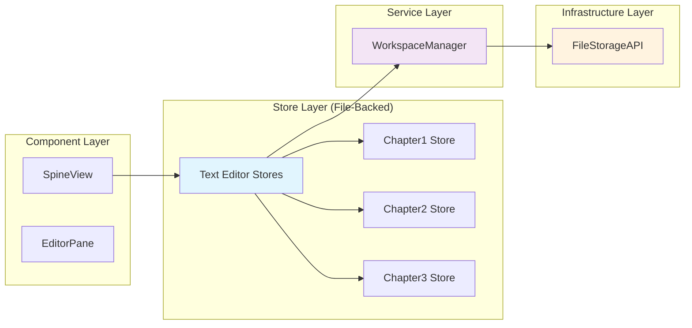

# Deterministic Spine Editing Architecture

## Executive Summary

The SpineView component currently suffers from race conditions and data corruption during spine item switching. This document proposes using the **existing text-editor-store API** with file-backed stores to create deterministic content management, eliminating data corruption without adding new services or architectural complexity.

## Current State Analysis

### SpineView.svelte Responsibilities Audit

The current SpineView component handles **15 distinct responsibilities**:

1. **UI State Management**: Pane configurations, editor modes, loading states
2. **Service Initialization**: FileStorageAPI, ExtensionManager, BlobURLManager, SettingsService
3. **File I/O Operations**: Reading/writing text files, CSS, JavaScript files
4. **Content Persistence**: LocalStorage state management via NavigationStore
5. **Auto-save Logic**: Debounced saving with race condition protection
6. **File Type Management**: File type classification and path resolution
7. **Preview Management**: Transform pipeline, XHTML generation, error handling
8. **Spine Item Loading**: Complex loading logic with race condition protection
9. **Content Switching**: Auto-save current content before switching spine items
10. **Data Integrity**: File consistency and corruption detection
11. **Debug Logging**: Comprehensive state dumps and tracing
12. **Event Handling**: File selection, content changes, pane toggles
13. **State Restoration**: Complex pane state restoration logic
14. **Error Recovery**: Data corruption repair functions
15. **ViewComponent Interface**: Navigation lifecycle management

### Current Architecture Problems

#### 1. **Violation of Single Responsibility Principle**

SpineView has grown to **1,200+ lines** with multiple unrelated concerns mixed together.

#### 2. **Race Conditions from Multiple Entry Points**

Content loading can be triggered by:

- `onViewEnter()` (line 185)
- `setViewData()` (line 198)
- Reactive statement (line 1133)
- Navigation events
- Component lifecycle events

#### 3. **Complex State Management**

Multiple interdependent state variables:

```typescript
let selectedItem: SpineItemWithSource | null = null;
let paneState = { mode, pane1, pane2 };
let currentContent: CurrentContent;
let availableFiles: Array<FileInfo>;
let previewManager: any;
```

#### 4. **Tight Coupling**

Direct dependencies on 6 different services with complex initialization order requirements.

## Problem Analysis

### Root Cause: Asynchronous State Desynchronization

The data corruption occurs because of a **perfect storm** of architectural issues:

1. **Multiple Reactive Layers**: User typing (immediate) vs spine switching (async)
2. **Content in Pane State**: Stale content persisted and restored incorrectly
3. **Auto-save Race Conditions**: Path updates and content loading happen at different times
4. **Distributed State Ownership**: Content lives in multiple places (DOM, pane state, files)

### Why Previous Attempts Failed

Each attempt tried to fix **symptoms** instead of the **root cause**:

- **Loading Guards**: Fixed load concurrency, not content/path desynchronization
- **Content Persistence**: Fixed storage patterns, not timing issues
- **State Validation**: Fixed corruption detection, not prevention

## Proposed Architecture: File-Backed Text Editor Stores

### Using Existing Project Infrastructure

This solution leverages the **existing text-editor-store API** (see `src/lib/stores/text-editor-store-API.md`) with the **File-Backed Editors** pattern:

```typescript
// Existing proven pattern from the project
async function createFileBackedEditor(
  editorId: string,
  workspaceId: string,
  filePath: string,
  workspaceManager: IWorkspaceManager
) {
  // Load initial content from file
  let initialContent = '';
  try {
    initialContent = await workspaceManager.readTextFile(workspaceId, filePath);
  } catch {
    // File doesn't exist, start with empty content
  }

  const store = createTextEditorStore(editorId, initialContent);

  // Auto-save to file when content changes (debounced)
  let saveTimeout;
  store.subscribe(state => {
    clearTimeout(saveTimeout);
    saveTimeout = setTimeout(async () => {
      try {
        await workspaceManager.writeTextFile(workspaceId, filePath, state.content);
      } catch (error) {
        console.error('Auto-save failed:', error);
      }
    }, 1000); // 1 second debounce for file saves
  });

  return store;
}
```

### Lazy Store Pool Pattern for Deterministic Spine Switching

To eliminate data corruption, spine switching will use **lazy store initialization** with session-scoped store pooling:

```typescript
// Current approach (causes corruption):
// 1. User switches from chapter1 to chapter2
// 2. Save current content from DOM
// 3. Load new content from file
// 4. Update DOM with new content
// ❌ Race conditions between save/load operations

// New approach (deterministic with performance):
// 1. User switches from chapter1 to chapter2
// 2. Get or create chapter2 store (lazy initialization)
// 3. Switch current store reference
// 4. Return to chapter1 later - reuses existing store (instant)
// ✅ No race conditions + performance optimization for session
```

### Utility Method Addition

```typescript
// Add to src/lib/source/source-utils.ts
export function getTextFilePath(spineId: string): string {
  return `SOURCE/text/${spineId}.txt`;
}
```

### Simplified Architecture Diagram



### File-Backed Text Editor Store Implementation

#### Store Pool Management Functions

```typescript
// Add to SpineView.svelte
let spineTextStores = new Map<string, TextEditorStore>();
let currentTextStore: TextEditorStore | null = null;
let currentSpineId: string | null = null;

/**
 * Get existing store or create new one (lazy initialization)
 * Stores are cached for session-level performance
 */
async function getOrCreateSpineStore(
  workspaceId: string,
  spineId: string,
  workspaceManager: IWorkspaceManager
): Promise<TextEditorStore> {
  // Check if store already exists
  if (spineTextStores.has(spineId)) {
    return spineTextStores.get(spineId)!;
  }

  // Lazy initialization - create new store
  const editorId = `spine-text-${spineId}`;
  const filePath = SourceUtils.getTextFilePath(spineId);

  const store = await createFileBackedEditor(editorId, workspaceId, filePath, workspaceManager);

  // Cache for future use in this session
  spineTextStores.set(spineId, store);
  return store;
}

/**
 * Switch spine items using store pool
 * Eliminates race conditions while optimizing for performance
 */
async function switchToSpineItem(
  workspaceId: string,
  newSpineId: string,
  workspaceManager: IWorkspaceManager
): Promise<void> {
  // Skip if already selected
  if (currentSpineId === newSpineId) {
    return;
  }

  // Get or create store (reuses existing stores)
  const newStore = await getOrCreateSpineStore(workspaceId, newSpineId, workspaceManager);

  // Simple reference switch - no store destruction
  currentTextStore = newStore;
  currentSpineId = newSpineId;

  // EditorPane will automatically receive new content via reactive bindings
}
```

#### Data Integrity Features

1. **Lazy Store Pool**: Stores created on-demand and cached for session performance
2. **Auto-Save via Subscriptions**: File writes happen automatically when content changes
3. **Single Source of Truth**: Disk files are authoritative, stores sync automatically
4. **Elimination of Race Conditions**: No concurrent save/load operations during switching
5. **Session-Scoped Caching**: Fast switching between recently accessed spine items
6. **Deterministic Initialization**: Store creation always loads current file state

### Implementation Strategy

#### Detailed 3-Step Implementation (2 Hours Total)

**Step 1: Add Required Infrastructure (15 minutes)**

- Add `getTextFilePath(spineId)` method to `src/lib/source/source-utils.ts`
- Import `createTextEditorStore` from `$lib/stores/text-editor-store` in SpineView.svelte
- **Risk**: None - pure utility function and existing import

**Step 2: Implement File-Backed Store Pattern (1 hour)**

- Create `createFileBackedSpineStore()` function in SpineView.svelte (implementing the pattern from API docs)
- Add `getOrCreateSpineStore()` and `switchToSpineItem()` functions with Map-based store pool
- Replace manual auto-save logic with store subscription auto-save
- **Risk**: Low - uses existing createTextEditorStore with file I/O wrapper

**Step 3: Update Component Integration (45 minutes)**

- Remove `pane1Content` and `pane2Content` props from EditorPane
- Add store binding pattern for EditorPane textarea elements
- Remove content from `paneState` structure and navigation store persistence
- Remove manual `debounceAutoSave` and `handlePaneContentChange` functions
- **Risk**: Medium - changes component integration, but simplifies overall logic

### Success Criteria

#### Primary Goal: Eliminate Data Corruption

- ✅ **Zero "POTENTIAL DATA CORRUPTION" warnings**
- ✅ **Correct content loaded for each spine item**
- ✅ **Auto-save writes to correct files**
- ✅ **No race conditions during spine switching**
- ✅ **Content does not persist in pane state**

#### Secondary Benefits

- **Uses Existing Patterns**: Leverages proven text-editor-store API
- **Simplifies Architecture**: Removes complex state synchronization logic
- **Improves Testability**: File-backed stores can be tested independently
- **Reduces Code Complexity**: Eliminates custom auto-save and race condition handling

### Risk Analysis

#### High Risk

- **Data Loss**: Migration could cause content loss if not handled carefully
- **Regression**: Complex component behavior might be missed during extraction
- **Breaking Changes**: Service API changes could break other components

#### Mitigation Strategies

- **Incremental Migration**: Phase-by-phase implementation with testing after each phase
- **Backup Strategy**: Automatic content backup before any migration step
- **Feature Flags**: Ability to rollback to original implementation if needed
- **Comprehensive Testing**: Unit tests for services, integration tests for component

### Implementation Timeline

| Step      | Duration    | Dependencies | Deliverables                        |
| --------- | ----------- | ------------ | ----------------------------------- |
| Step 1    | 10 minutes  | None         | Utility method added                |
| Step 2    | 1 hour      | Step 1       | Store pool functions created        |
| Step 3    | 1 hour      | Step 2       | SpineView updated to use store pool |
| **Total** | **2 hours** |              | **Data corruption fix complete**    |

## Detailed Implementation Guide

### Step 1: Infrastructure Setup

#### Add Utility Method to source-utils.ts

```typescript
// Add to src/lib/source/source-utils.ts
export function getTextFilePath(spineId: string): string {
  return `SOURCE/text/${spineId}.txt`;
}
```

#### Add Import to SpineView.svelte

```typescript
// Add to existing imports in SpineView.svelte
import { createTextEditorStore } from '$lib/stores/text-editor-store';
import { getTextFilePath } from '$lib/source/source-utils';
```

### Step 2: Implement File-Backed Store Pattern

#### Create File-Backed Store Function

```typescript
// Add to SpineView.svelte - implements the pattern from text-editor-store-API.md
async function createFileBackedSpineStore(
  spineId: string,
  workspaceId: string,
  workspaceService: WorkspaceService
): Promise<TextEditorStore> {
  const editorId = `spine-text-${spineId}`;
  const filePath = getTextFilePath(spineId);

  // Load initial content from file
  let initialContent = '';
  try {
    const buffer = await workspaceService.readFile(workspaceId, filePath);
    initialContent = new TextDecoder().decode(buffer);
  } catch {
    // File doesn't exist, start with empty content
  }

  const store = createTextEditorStore(editorId, initialContent);

  // Auto-save to file when content changes (1000ms debounce)
  let saveTimeout: ReturnType<typeof setTimeout>;
  store.subscribe(state => {
    clearTimeout(saveTimeout);
    saveTimeout = setTimeout(async () => {
      try {
        const encoder = new TextEncoder();
        const buffer = encoder.encode(state.content);
        await workspaceService.writeFile(workspaceId, filePath, buffer);
        console.log(`Auto-saved: ${filePath}`);
      } catch (error) {
        console.error('Auto-save failed:', error);
      }
    }, 1000); // 1 second debounce for file saves
  });

  return store;
}
```

#### Replace Manual Auto-Save with Store Pool

```typescript
// Replace existing auto-save state in SpineView.svelte
// REMOVE these lines:
// let autoSaveTimeouts = new Map<string, ReturnType<typeof setTimeout>>();
// function debounceAutoSave(...) { ... }
// function handlePaneContentChange(...) { ... }

// ADD store pool management:
let spineTextStores = new Map<string, TextEditorStore>();
let currentTextStore: TextEditorStore | null = null;
let currentSpineId: string | null = null;

async function getOrCreateSpineStore(
  workspaceId: string,
  spineId: string,
  workspaceService: WorkspaceService
): Promise<TextEditorStore> {
  // Check if store already exists
  if (spineTextStores.has(spineId)) {
    return spineTextStores.get(spineId)!;
  }

  // Create new file-backed store
  const store = await createFileBackedSpineStore(spineId, workspaceId, workspaceService);

  // Cache for session
  spineTextStores.set(spineId, store);
  return store;
}

async function switchToSpineItem(
  workspaceId: string,
  newSpineId: string,
  workspaceService: WorkspaceService
): Promise<void> {
  if (currentSpineId === newSpineId) return;

  // Get or create store (reuses existing stores)
  const newStore = await getOrCreateSpineStore(workspaceId, newSpineId, workspaceService);

  // Simple reference switch - no store destruction
  currentTextStore = newStore;
  currentSpineId = newSpineId;
}
```

### Step 3: Component Integration Changes

#### Update Pane State Structure

```typescript
// MODIFY existing paneState in SpineView.svelte
// REMOVE content properties:
let paneState = {
  mode: 'single' as 'single' | 'dual',
  pane1: {
    filePath: '',
    fileHref: '',
    fileType: '',
    contentType: null as ContentType | null,
    selectedFileValue: '', // For dropdown display
    // REMOVE: content: ''
  },
  pane2: {
    filePath: '',
    fileHref: '',
    fileType: '',
    contentType: null as ContentType | null,
    selectedFileValue: '', // For dropdown display
    // REMOVE: content: ''
  },
};
```

#### Update EditorPane Integration

```typescript
// MODIFY EditorPane props in SpineView.svelte template
// CHANGE FROM:
// pane1Content={paneState.pane1.content}
// pane2Content={paneState.pane2.content}
// on:contentChange={handlePaneContentChange}

// CHANGE TO (pass text store directly):
bind: currentTextStore = { currentTextStore };
// Remove on:contentChange - auto-save handled by store subscription
```

#### Update EditorPane.svelte to Accept Store

```typescript
// MODIFY EditorPane.svelte props
// REMOVE:
// export let pane1Content: string = '';
// export let pane2Content: string = '';

// ADD:
export let currentTextStore: TextEditorStore | null = null;

// UPDATE textarea binding:
// CHANGE FROM:
// <textarea bind:value={paneValue} on:input={handleInput}>

// CHANGE TO:
// <textarea
//   value={currentTextStore ? $currentTextStore.content : ''}
//   on:input={(e) => currentTextStore?.updateContent(e.target.value)}
// >
```

#### Update Navigation Store Persistence

```typescript
// MODIFY persistPaneConfiguration function
function persistPaneConfiguration() {
  const config: SpineEditorConfig = {
    pane1: paneState.pane1.fileType
      ? {
          fileType: paneState.pane1.fileType,
          selectedFile: paneState.pane1.filePath,
          // REMOVE: content is never persisted - always loaded fresh from disk
        }
      : null,
    pane2: paneState.pane2.fileType
      ? {
          fileType: paneState.pane2.fileType,
          selectedFile: paneState.pane2.filePath,
          // REMOVE: content is never persisted - always loaded fresh from disk
        }
      : null,
    mode: paneState.mode,
  };

  navigationStore.updateSpineConfig(selectedItemId, config);
}
```

#### Integrate with Spine Switching Logic

```typescript
// MODIFY existing spine switching logic in SpineView.svelte
// Replace loadSpineItemContent calls with switchToSpineItem

// CHANGE loadSpineItem function:
async function loadSpineItem(spineId: string) {
  // ... existing loading logic ...

  // REPLACE manual content loading with store switching:
  await switchToSpineItem(workspace.id, spineId, workspaceService);

  // Update UI to reflect current store
  // (reactive bindings will automatically update EditorPane)
}
```

#### Add Cleanup on Component Destroy

```typescript
// ADD to SpineView.svelte
import { onDestroy } from 'svelte';

onDestroy(() => {
  // Clean up all text editor stores
  for (const [spineId, store] of spineTextStores) {
    store.destroy(); // Remove from text-editor-store registry
  }
  spineTextStores.clear();
});
```

## Technical Specifications

### Updated Component Interfaces

#### EditorPane Props (Clean State)

```typescript
// Updated EditorPane props - content removed from pane state
export let editorMode: 'single' | 'dual' = 'single';
export let pane1SelectedFile: string = '';
export let pane2SelectedFile: string = '';
// Content props removed - handled by text editor stores

// Text editor stores passed as props
export let pane1TextStore: TextEditorStore | null = null;
export let pane2TextStore: TextEditorStore | null = null;
```

#### SpineView Store Pool Management

```typescript
// Store pool - session-scoped caching
let spineTextStores = new Map<string, TextEditorStore>();
let currentTextStore: TextEditorStore | null = null;
let currentSpineId: string | null = null;

// Pane state (no content)
let paneState = {
  mode: 'single' as 'single' | 'dual',
  pane1: { selectedFile: 'text' },
  pane2: { selectedFile: '' },
};
```

#### Store Creation and Management

```typescript
// Store pool utilities
interface SpineStorePool {
  getOrCreateStore(
    workspaceId: string,
    spineId: string,
    workspaceManager: IWorkspaceManager
  ): Promise<TextEditorStore>;

  switchSpineItem(
    workspaceId: string,
    newSpineId: string,
    workspaceManager: IWorkspaceManager
  ): Promise<void>;

  getCurrentStore(): TextEditorStore | null;
  hasStore(spineId: string): boolean;
  getStoreCount(): number;
}

// Clean pane configuration (no content)
interface CleanPaneState {
  mode: 'single' | 'dual';
  pane1: { selectedFile: string };
  pane2: { selectedFile: string };
  // No content properties
}
```

### Error Handling Strategy

#### Store Creation Errors

```typescript
// Store pool with error handling
async function getOrCreateSpineStore(
  workspaceId: string,
  spineId: string,
  workspaceManager: IWorkspaceManager
): Promise<TextEditorStore | null> {
  try {
    // Check cache first
    if (spineTextStores.has(spineId)) {
      return spineTextStores.get(spineId)!;
    }

    // Create new store
    const editorId = `spine-text-${spineId}`;
    const filePath = SourceUtils.getTextFilePath(spineId);

    const store = await createFileBackedEditor(editorId, workspaceId, filePath, workspaceManager);

    // Cache for session
    spineTextStores.set(spineId, store);
    return store;
  } catch (error) {
    console.error(`Failed to get/create text store for spine ${spineId}:`, error);
    return null;
  }
}
```

#### Component Error Boundaries

SpineView will handle store errors gracefully:

```typescript
let storeError: string | null = null;

async function switchToSpineItem(
  workspaceId: string,
  newSpineId: string,
  workspaceManager: IWorkspaceManager
): Promise<void> {
  try {
    storeError = null;

    // Get or create store with error handling
    const newStore = await getOrCreateSpineStore(workspaceId, newSpineId, workspaceManager);

    if (newStore) {
      currentTextStore = newStore;
      currentSpineId = newSpineId;
    } else {
      storeError = `Failed to load content for ${newSpineId}`;
    }
  } catch (error) {
    storeError = 'Unexpected error during spine switching';
    console.error('Spine switching error:', error);
  }
}
```

## Conclusion

This **file-backed store solution** addresses the data corruption issue by:

1. **Using existing proven patterns** - Leverages the established text-editor-store API
2. **Eliminating race conditions** - Store recreation prevents state desynchronization
3. **Simplifying architecture** - Removes complex auto-save and state management logic
4. **Ensuring single source of truth** - Disk files are authoritative, no cached content

**Key Benefits:**

- ✅ **Eliminates data corruption** during spine item switching
- ✅ **Uses existing project infrastructure** - No new services required
- ✅ **Minimal implementation time** - 2 hours vs complex service architecture
- ✅ **Reduces complexity** - Removes custom state synchronization
- ✅ **Improves maintainability** - File-backed stores are self-contained and testable

**Implementation Highlights:**

- **Lazy Store Pool Pattern**: Stores created on-demand and cached for session performance
- **Auto-Save via Subscriptions**: Content saves happen automatically when changed
- **Clean Pane State**: Content removed from pane persistence, only file selection stored
- **Session-Scoped Optimization**: Fast switching between recently accessed spine items
- **Deterministic Behavior**: No async state coordination, eliminating race conditions

This approach solves the immediate problem using the project's existing text-editor-store infrastructure, resulting in cleaner, more maintainable code with deterministic behavior.
